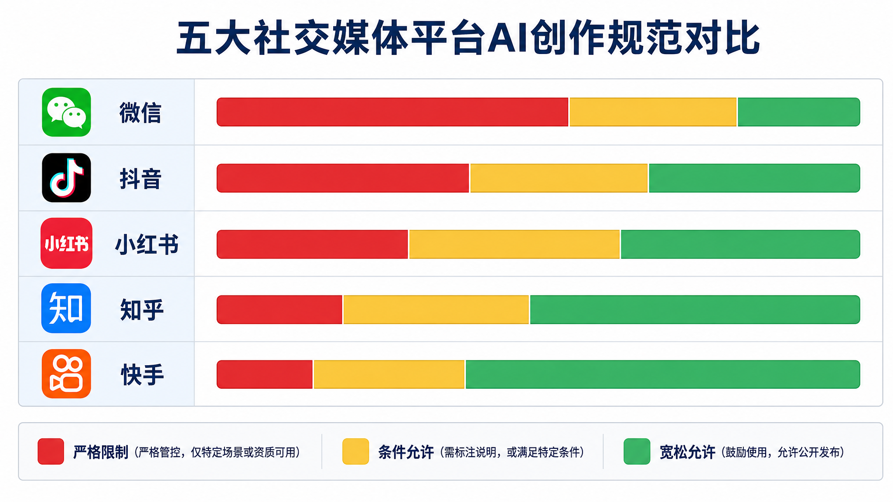
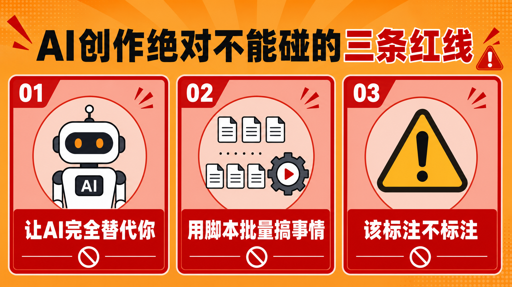
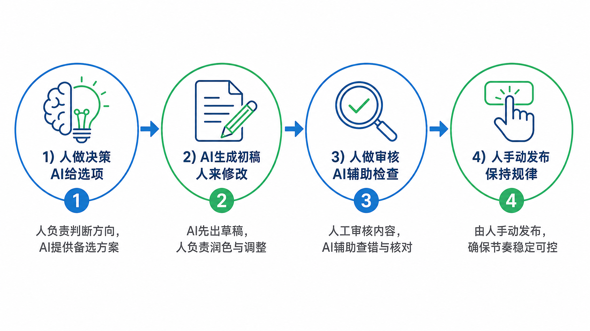

> 90后夫妻靠AI运营账号年赚200万，一夜之间所有账号被封。微信、抖音、小红书集体出手，AI创作的合规红线到底在哪里？本文为你深度拆解。

---

## 引言

运营圈最近被一则消息刷屏了。

一对90后夫妻，通过AI托管运营多个账号，年收入超过200万。然而，一夜之间，**所有账号全部被封**，违规所得被全数没收。

这不是个案。2026年4月，中央网信办开展专项整治，依法依约处置违规账号**9.8万余个**。微信、抖音、小红书等主流平台相继出台AI创作管理规范，铁腕治理违规行为。

作为运营人，你必须搞清楚三件事：**平台的红线在哪里？什么行为会被封号？如何正确使用AI而不踩雷？**

本文将结合真实案例和平台政策，为你详细拆解。

---

## 一、事件回顾：200万收入如何归零

### 案例始末

这对90后夫妻的操作模式是：

- 用AI工具批量生成内容
- 用脚本自动化发布
- 多账号矩阵运营

听起来很高效，对吧？

但问题在于：**整个流程几乎没有"人"的参与。**

平台的风控系统精准识别了这种"非真人操作"模式，不仅封禁了所有账号，还没收了违规所得。

### 核心教训

1. **AI可以是工具，但不能是主体**：平台要的是"真人创作、AI辅助"，不是"AI主导、真人挂名"
2. **批量操作是大忌**：一个人管理10个账号和100个账号，在平台眼中是不同的
3. **合规是底线，不是天花板**：不要以为"没被发现"就是安全的

---

## 二、各平台都在管AI，但力度不一样

你可能已经感觉到，最近各平台对AI创作的态度越来越严格了。

但严格归严格，每个平台的玩法还不太一样。有的平台是"睁一只眼闭一只眼"，有的平台是"零容忍"。如果你不清楚这些区别，很容易踩坑。

我梳理了主流平台的规范，帮你搞清楚每个平台的红线和边界。

---

### 微信公众平台：管得最细，但执行相对宽松

微信的规范写得很详细，但实话说，执行力度没有抖音那么强硬。

微信的核心逻辑是：**你可以用AI，但你得像个"真人"一样用。**

什么叫"真人一样用"？

就是不要让平台觉得你是在批量生产内容。比如你用AI生成了一篇文章，但你在里面加了自己的经历、自己的观点、自己的感悟，平台不会管你。但如果你是：

- 用AI每天生成10篇文章批量发
- 文章结构一模一样，只是换个关键词
- 整个账号就是一个AI内容工厂

那对不起，限流、封禁、甚至封号都有可能。

另外，微信还有一个容易被忽略的规定：**禁止传播AI自动化创作的教程和服务**。也就是说，如果你公开教别人怎么用AI批量做号，对不起，你违规了。

---

### 抖音：执行最严，标注是必须的

抖音是我见过对AI内容管理最严格的平台，没有之一。

抖音的逻辑是：**你可以用AI，但你必须告诉观众这是AI。**

这个"告诉"不是嘴上说说就行的。官方明确要求：

- AI生成的视频，必须在描述里标注"本视频由AI生成"
- AI配音、AI换脸等，都需要明确标注
- 甚至用AI生成脚本、但真人出镜的情况，也要说明

如果你不标注呢？

抖音的风控系统不是吃素的。前段时间有个博主，用AI克隆自己的声音做视频，没标注，结果被平台降权，播放量从几十万直接掉到几百。

抖音还有一个重点打击对象：**AI模拟真人互动**。比如用AI批量回复评论、用AI模拟真人账号做互动，这些都属于高危行为。

---

### 小红书：态度微妙，批量是红线

小红书的态度比较微妙。

官方并没有完全禁止AI创作，但有一个明确的底线：**批量生产是绝对红线。**

什么叫批量生产？比如：

- 一个账号每天发10篇AI生成的笔记
- 10个账号同时发一模一样的AI内容
- 用AI托管的方式，让机器自动注册、自动发布、自动回复

这些行为，小红书的打击力度很大。尤其是2026年以来，平台明显加强了对"AI托管账号"的识别和处置。

但如果是正常的AI辅助创作，比如：

- AI给你一个灵感，你自己写
- AI帮你润色，你自己改
- AI生成配图，你自己写文案

这些都没问题。小红书要的是"有灵魂的内容"，不是"高效的机器生产"。

---

### 知乎：强调观点，人味儿是核心

知乎的规范很有意思，它的逻辑是：**答案可以由AI生成，但你得让人看不出来。**

这话听起来有点矛盾，但仔细想想很有道理。

知乎的用户群体相对高端，他们来这里是想看真人的思考、真人的经验、真人的观点。如果你的回答：

- 全是泛泛而谈的大道理
- 没有具体案例、没有个人经历
- 逻辑完美得像教科书

那大概率会被判定为AI生成。

知乎还有一个特殊的地方：**它对"引用和标注"的要求比较宽松**。不像抖音那样强制标注"AI生成"，知乎更看重的是内容本身的质量和"人味儿"。

---

### 快手：和抖音类似，但执行稍松

快手的规范和抖音很像，都是"要求标注AI生成内容"。

但实话说，快手的执行力度没有抖音那么严格。至少目前来看，快手对AI内容的容忍度比抖音高一些。

快手的用户群体和抖音有差异，内容风格也更接地气。所以如果你在快手上用AI创作，标注清楚、别太明显是AI写的，一般问题不大。

---

### 总结：各平台的红线在哪里

| 平台 | 核心红线 | 标注要求 | 执行力度 |
|------|---------|---------|---------|
| 微信 | 批量生产 | 无强制标注 | 中等 |
| 抖音 | 标注 + 真实互动 | 必须标注 | 最严 |
| 小红书 | 批量托管 | 无强制标注 | 较严 |
| 知乎 | 内容有观点 | 无强制标注 | 中等 |
| 快手 | 标注 | 建议标注 | 中等偏松 |

**一个核心结论：没有平台是完全禁止AI的，但所有平台都讨厌"没有灵魂的AI批量生产"。**

---

## 三、这三个坑千万别踩

说完各平台的规范，你可能还是有点懵：那我到底怎么做才算合规？

别急，我给你划三条绝对不能碰的红线。踩了任何一条，轻则限流、重则封号，没有任何商量余地。

---

### 红线一：让AI完全替代你

这是最多人踩的坑。

什么叫"让AI完全替代你"？就是你把账号交给AI，从内容生成到发布到互动，全流程都是机器在跑，你只负责"看着"。

听起来很爽对吧？躺着赚钱。

但问题是：**平台比你更清楚什么叫"真人操作"。**

各平台的风控系统都在进化，它们会监测你的操作频率、发布规律、互动模式。一旦发现你的账号像个机器人一样精准、高效、永不犯错，风控系统就会自动标记你。

然后，一夜回到解放前。

而且我告诉你一个事实：**封号之前，没有任何"警告期"。**

不是说你先用AI跑一个月，平台发现后再来警告你。不存在的。风控系统一旦识别到你的是"机器行为"，直接封，没有任何商量。

所以，正确的做法是：**AI可以生成内容，但发布必须由你操作。AI可以提供建议，但决策必须由你来做。**

---

### 红线二：用脚本批量搞事情

这个坑，主要是那些做"账号矩阵"的人踩的。

什么叫"账号矩阵"？就是一个人运营几十个、甚至上百个账号。为了管理这么多个账号，很多人会用脚本实现自动化：定时发布、一键分发、批量回复。

在平台眼里，这是高危行为。

为什么？因为**正常运营者根本不会这么做**。

你想想看：一个真实的人，一天能管几个账号？3个？5个？顶天了10个。但如果你能管100个账号，那只能说明一件事——你用了工具。

平台对这种"不正常"的操作模式，非常敏感。

用脚本批量发布，轻则限流，重则连坐——你旗下的所有账号一起被处理。我见过最狠的案例，一个人管50个账号，其中一个账号违规被封，结果50个账号全部阵亡。

所以，**脚本批量发布这件事，能不用就不用**。

如果你确实需要管理多个账号，那就老老实实用"笨办法"：人工登录、人工发布、人工回复。虽然效率低一点，但至少安全。

---

### 红线三：该标注的时候不标注

这条红线很多人会忽略，觉得"我用了AI但内容写得好，标注不标注有什么关系"。

**有关系，而且关系很大。**

首先，从法规层面看，《互联网信息服务深度合成管理规定》已经明确要求，AI生成的内容必须要有显著标识。这是法律层面的要求，不是平台的"建议"。

其次，从平台层面看，抖音、小红书等平台都有明确的内容标注要求。如果你用了AI但没有标注，被发现后轻则降权，重则封禁。

第三，从用户层面看，现在的读者越来越精明了。他们能看出来哪些内容是"AI味"的——逻辑过于完美、结构过于工整、语气过于中庸。如果你用了AI但假装是自己写的，一旦被发现，信任崩塌。

所以，**该标注就标注**。文章开头加一句"本文由AI辅助创作"、视频描述里写一个"AI配音"、笔记末尾加一个"#AI辅助#"——就这么简单的一件事，能省去很多麻烦。

---

## 四、正确的AI辅助创作姿势

说了这么多不能做的，那到底怎么做才对？

我的经验是：**把AI当助手，而不是替身。**

什么是"替身"？就是让AI代替你工作，你只负责收成果。这是大多数人的用法，也是最容易出问题的方式。

什么是"助手"？就是让AI帮你提效，但核心工作还是你自己做。这是正确的方式。

具体来说，我建议用一个简单的框架：**人主导，AI辅助**。

---

### 第一步：人做决策，AI给选项

创作的第一步，是确定你要做什么内容。

这一步，必须由人来做。AI不知道你的用户是谁、你的账号定位是什么、你这个月要推什么主题。所以，**选题、方向、策略，这些都必须你来定**。

AI能帮你的是：给你提供思路、帮你做调研、帮你找素材。

比如你想写一篇关于"AI创作合规"的文章，你可以让AI帮你：

- 搜集相关的平台政策
- 列出可能的切入角度
- 查找最近的热门案例

但最终选哪个角度、怎么结构这篇文章，AI说了不算，你说了算。

---

### 第二步：AI生成初稿，人来修改

初稿阶段，AI可以大显身手。

让AI根据你的思路生成初稿，包括：

- 文章大纲
- 各段落的内容
- 可用的案例和数据

但请注意，我说的是"初稿"，不是"终稿"。

AI生成的初稿，通常有这些问题：

- 逻辑太完美，缺乏起伏
- 语言太工整，缺乏个性
- 案例太通用，缺乏独特性

所以，你需要对AI生成的初稿进行**深度加工**：

- 加入你的真实经历或观点
- 调整语言风格，让它更像"你"
- 补充具体的、独特的案例
- 删除那些放之四海而皆准的废话

**记住：AI的初稿是毛坯房，你的修改是精装修。**

---

### 第三步：人做审核，AI来辅助检查

发布之前，必须人工审核。

审核什么？

- 信息是否准确
- 是否有敏感内容
- 逻辑是否通顺
- 风格是否一致

AI可以帮你检查错别字、语病这些基础问题，但**判断内容是否合适，最终还是人来负责**。

另外，这个环节还有一个重要任务：**添加AI标注**。

根据各平台的要求，在适当的位置标注"本文由AI辅助创作"。这件事不要忘。

---

### 第四步：人手动发布，保持规律

最后一步是发布。

我的建议是：**尽量手动发布，不要用自动化工具**。

手动发布有几个好处：

- 你会在发布前再看一遍内容，减少出错
- 你的发布行为会更"像真人"
- 你可以针对每篇内容调整发布时间

有人可能会说："我一天发5篇文章，手动发布太累了。"

我的回应是：**如果你一天能产出5篇高质量的真人创作，那你可以一天发5篇。如果你的5篇文章都是AI批量生成的，那对不起，平台不欢迎你。**

质量比数量重要。

---

### 快速检查清单

发布之前，30秒过一遍：

- 选题是我自己定的吗？✓
- 内容有我自己的观点吗？✓
- 有真实的案例或经历吗？✓
- 该标注的地方标注了吗？✓
- 这是"人写"的感觉，不是"AI写"的感觉？✓

---

## 五、5个过来人的忠告

聊了这么多规范和技巧，最后我想分享5个忠告。这些都是我在运营过程中踩过的坑、总结出的经验，希望能帮你少走弯路。

---

### 忠告一：AI是效率工具，不是赚钱机器

很多人用AI的思路是：AI帮我写内容 → 内容帮我赚钱 → 我躺着数钱。

这个思路有问题。

AI确实能帮你提升效率，但它提升的是"生产内容"的效率，不是"让内容赚钱"的效率。

内容能不能赚钱，取决于内容有没有价值。你的选题好不好、观点独不独特、能不能解决用户的问题——这些AI帮不了你。

所以，用AI的正确心态是：**把节省下来的时间，用来提升内容质量，而不是用来多发内容。**

如果你用AI每天写10篇垃圾，不如认真写1篇精品。

---

### 忠告二：你的账号要有"人设"

什么叫"人设"？就是读者一想到某个话题，就能想到你。

比如你长期写"AI运营"相关的内容，你在读者心中就是"AI运营领域的专家"。他们遇到相关问题，就会想到来找你。

但这种"人设"，AI给不了你。

AI能帮你写文章，但它不能帮你建立影响力。影响力的建立，需要：

- 持续输出同一领域的观点
- 积累真实的读者信任
- 形成独特的个人风格

这些，都需要时间和真人参与。

所以，不要想着用AI快速起号。**真正有影响力的账号，都是慢慢积累出来的。**

---

### 忠告三：别和平台对着干

这条听起来像废话，但我见过太多人踩坑。

有些人知道平台在打击AI批量生产，但还是抱着侥幸心理：别人都这么干，我也可以。

然后有一天，账号突然被封了，来找我哭诉。

我的回应是：**平台不是傻子，你的小聪明它都看在眼里。**

今天没封你，可能是因为：

- 你还没触碰到红线
- 平台还没轮到处理你
- 风控系统的识别还没那么精准

但这些"今天没封"，不等于"永远不封"。

所以，**别和平台对着干**。平台要什么，你就给什么。平台打击什么，你就别碰什么。这是最基本的生存法则。

---

### 忠告四：关注政策，但不要焦虑

平台政策一直在变，这是事实。

很多人因为担心政策变化，陷入焦虑：今天抖音出了新规，我该怎么做？明天小红书会不会也出类似规定？

我的建议是：**关注政策，但不要焦虑。**

政策变化有规律：

- 打击的是"明显违规"的行为，不是"擦边球"
- 给你留了调整的窗口期，不是一刀切
- 最终目标是"好内容"，不是"禁止AI"

所以，你只需要关注一件事：**你的内容对用户有没有价值。**

有价值的内容，政策怎么变都不用怕。没价值的内容，政策不变也迟早被淘汰。

---

### 忠告五：最靠谱的运营，是认真运营

说了这么多技巧，最后一条最朴素：**认真做内容。**

认真选题、认真写作、认真回复评论、认真分析数据。

AI可以帮你提效，但它不能帮你认真。

那些真正跑出来的账号，没有一个是靠AI批量生产的。他们靠的是：**对内容的敬畏，对用户的尊重，对运营的投入。**

AI是你路上的加速器，不是终点。

**终点是你能为用户创造什么价值。**

---

写到最后，我想说一句掏心窝的话：

AI浪潮来了，很多人慌了。怕被AI取代，怕跟不上时代，怕错过红利。

但我想说：**慌什么？**

AI再厉害，它也是工具。工具是给人用的，不是用来吓人的。

真正有竞争力的人，从来不是跑得最快的人，而是**最会用工具的人**。

学会用AI，但不依赖AI。
认真做内容，但不被流量绑架。
遵守规则，但不被规则束缚。

这才是AI时代的正确姿势。

---

## 六、运营团队如何做到合规

在接触了大量被封号案例后，我发现一个规律：**被封号的团队，往往不是故意违规，而是不知道边界在哪里。**

真正合规的团队，通常有以下几个特征：

**人工审核是标配。** AI生成的内容，必须经过人工审核才能发布。审核不是走流程，而是真正看一遍、改一遍。这个"人工"环节，是合规的底线。

**内容有差异化。** 同样是写"AI创作合规"，10个人写出来的文章应该各有特色。如果10篇文章结构一样、案例相似、观点雷同，平台会判定为批量生产。

**账号运营有"人味"。** 真实的互动记录、规律的上线时间、偶尔的"失误"，这些反而是账号健康的证明。那些24小时秒回、永远准时发布、从不犯错的账号，反而最可疑。

**政策跟踪是日常工作。** 平台政策不是一成不变的。一个成熟的运营团队，应该有人专门负责跟踪平台公告，及时调整策略。

合规不是束缚，而是保障。只有理解规则的逻辑，才能在规则范围内游刃有余。

---

## 总结

AI是工具，不是捷径。合规是底线，不是天花板。

那些试图绕过规则的人，最终都会被规则反噬。但那些理解规则、善用工具的人，正在用AI提升效率的同时，守住底线、保持独特。

**正确的态度是：拥抱AI，提升效率；坚守底线，保持独特。**

**你的账号有被限流或封禁的经历吗？是因为什么原因？欢迎在评论区分享，我们一起避坑。**

如果身边有做运营的朋友，这篇文章也许能帮他少走弯路——转发分享，是最好的支持。

---

## 数据来源

- 国家互联网信息办公室专项整治公告，2026年4月
- 抖音平台社区自律公约，2026年修订版
- 小红书创作者行为规范，2026年Q1
- 快手平台内容审核规范，2026年3月

---

*本文由Holamuse团队出品 | 专注合规运营*
