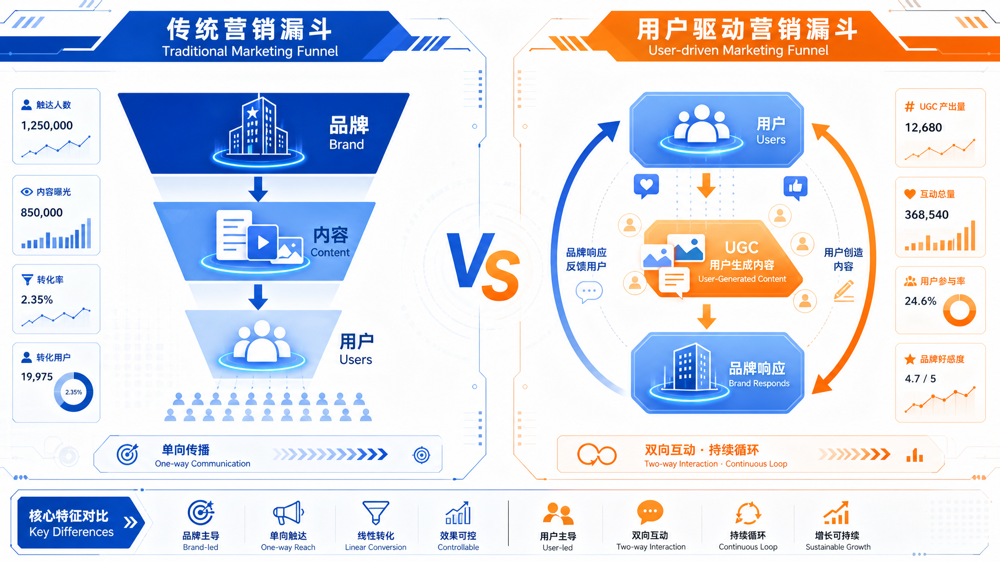
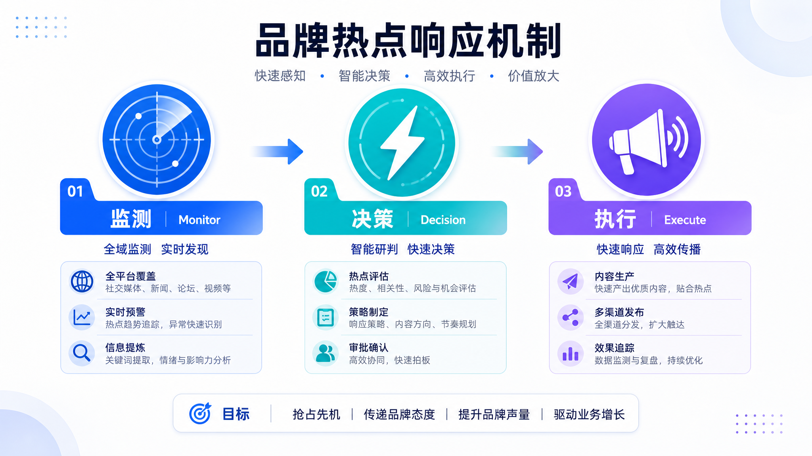

# 半个月涨粉176万：那些"没花钱"的品牌才是高手

> 何润东翻红这件事，最有意思的不是他本人，而是那些48小时内蜂拥而至的品牌。

---

## 01 用户成了主角，品牌变成了"接盘侠"

先说一个让我愣住的数据：

半个月，抖音涨粉**176万**，二创视频播放**12亿次**，6个国民级品牌排队合作。

何润东本人做了什么？

**他什么都没做。**

那些品牌做了什么？

48小时内，王者荣耀出了皮肤、支付宝搞了联名、京东拉着何润东去了球赛现场。

很多人看完这个案例，第一反应是："这些品牌反应真快！"

但我仔细想了想，这事儿没那么简单。

**他们快，不是因为他们有预案，而是因为他们一直在"等"。**

> 从用户定义内容，到平台放大传播，再到品牌承接商业化。在这条链路里，品牌不再是起点，而是最后进场的人。

---

## 02 那些被品牌"丢掉"的东西，正在被用户"捡回来"

很多人没意识到，这场翻红背后藏着三个扎心的真相：

**第一个：品牌正在失去"内容生产权"**

以前，品牌是起点：品牌决定做什么内容，用户被动接收。

现在，用户是起点：用户决定什么能火，品牌只能跟着接。

何润东的项羽片段被翻出来的时候，没有任何一个品牌提前知道。但48小时后，三个品牌同时官宣。

他们不是"创造者"，而是"接住者"。

**第二个：品牌正在失去"爆款定价权"**

以前，爆款是品牌"推"出来的。

现在，爆款是用户"玩"出来的。

一个旧片段，12亿次播放。不是花钱投出来的，是网友自发二创出来的。

**第三个：情绪比信息更值钱**

你仔细想想，一个明星的旧片段，为什么能被12亿人看到？

不是因为信息量高，而是因为**情绪共鸣强**。

项羽这个角色，戳中了某种集体记忆——霸气、悲壮、不甘。这种情绪，比任何文案都容易传播。

---

## 03 AI让这件事变得更快、更不可控

这场翻红事件中，AI二创是个关键变量。

一个视频片段，被AI快速生成出水墨风、国风、潮流风、游戏风、搞笑风......

> AI二创让内容变异的成本几乎为零。一段视频可以被AI快速生成100种版本。

这意味着什么？

**热点来得更快，去得也更快。**

品牌几乎不可能再回到"起点"位置——你永远不知道下一个热点从哪里冒出来。

但反过来说，如果你有一套"快速响应"的机制，你就能比别人更快"接住"用户的热情。

---

## 04 那些"接住"用户的品牌，都做对了什么？

王者荣耀的回应很典型：

> "我们敏锐捕捉到了用户对何润东项羽形象的热情，第一时间响应，用游戏皮肤的形式将这份热爱延续。"

京东更绝：

> "'宿迁弟子何在'这句台词点燃了现场，我们用最短的时间把网友的情绪变成了现实。"

他们做对了什么？

**1. 建了"情绪雷达"**

不是等热点来了才反应，而是持续监测UGC趋势、追踪评论区喊话。

**2. 砍掉了审批链条**

传统品牌：发现热点 → 汇报 → 审批 → 预算 → 执行（一周后）

这几个品牌：发现热点 → 分级决策 → 执行（48小时内）

**3. 把自己变成了"放大器"**

他们没有主导传播，而是融入传播——顺着用户的热情，把热度接住、放大。

---

## 05 说到底，最好的营销不是"做"出来的

何润东的翻红，不是品牌的胜利，而是用户的胜利。

**那些品牌赢在哪里？**

赢在"快"——但这个快，不是临时抱佛脚，而是有一套一直在运转的"雷达+响应"系统。

赢在"轻"——他们没有花大预算做一套完整的营销方案，而是用最小的动作接住了最大的热度。

赢在"准"——他们知道自己不是"创造者"，而是"放大器"，所以选择融入而不是主导。

> 最好的营销，早已不是品牌自导自演，而是放下控制，与用户站在一起，把他们的热爱，真正变成品牌的生命力。

---

## 现在你能做的

**1. 建一套"热点雷达"**

不一定是大系统，可以指定一个人，每天看：热搜话题、评论区喊话、UGC二创趋势。

**2. 简化决策链条**

把"热点借势"变成一个可以直接拍板的权限，别让审批成为阻碍。

**3. 把自己当成"放大器"**

不是每个热点都要主导，有时候融入比主导更有力量。

**4. 储备"响应素材"**

有些热点是可以预判的——比如节假日的热点、重大赛事、经典IP。提前备好素材，来了就能快速出街。

---

**一句话总结：别再想着"做"营销了，学会"接"用户的热情吧。**

---

**数据来源**

- [1] 何润东翻红事件深度复盘 | Morketing | 2026-05-04
- [2] 王者荣耀、京东、支付宝品牌响应公告 | 各品牌官方 | 2026年4月

*本文由Holamuse团队出品 | 专注品牌增长与运营创新*