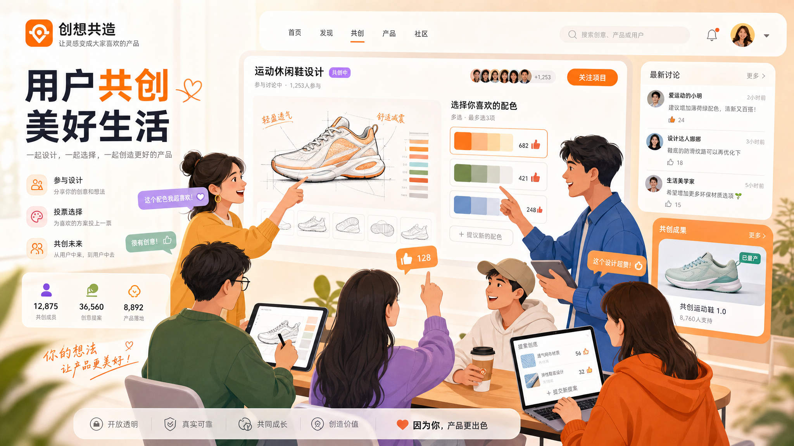
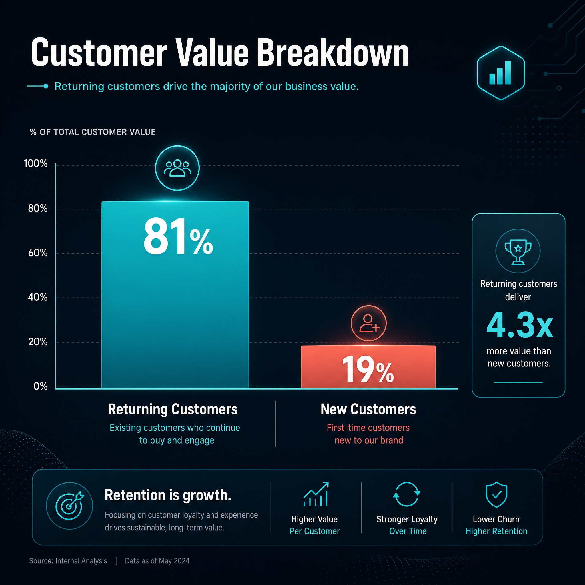
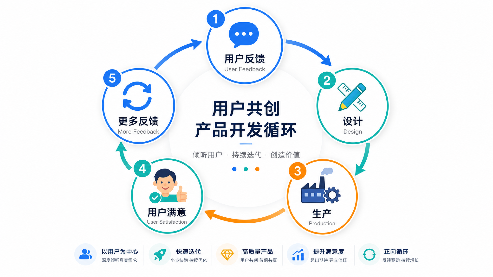

# 单款9万件、4个月2亿：那个"听劝"的品牌又爆了

> 一个洛丽塔服饰品牌，靠"把决定权交给用户"这件事，4个月卖了2个亿。

---

## 01 你以为"听劝"是玄学，其实是方法论

先看数据：

- 品牌话题浏览量：**2.6亿+**
- 单款裙子销量：**9万件**
- 4个月销售额：**2亿元**
- 老客贡献占比：**81%**
- 复购率：**40%**（行业平均32%）

做出这组数据的品牌叫"花与珍珠匣"，一个洛丽塔服饰品牌。

主理人小熙说过一句话，让我印象很深：

> "我发现用户比我更知道自己想要什么。与其我闭门造车，不如把决定权交给她们。"

很多人听完这句话，觉得是"运气好"或者"赛道对"。

但我仔细研究了一下，发现这不是玄学，而是一套可以复制的方法论。

---

## 02 "樱花系列"是怎么"听"出来的

花与珍珠匣有个爆款系列叫"樱花树下的告白"。

开发过程很有意思：

**颜色**：粉丝投票选出最受欢迎的颜色
**款式**：粉丝反馈调整裙摆长度和腰线设计
**面料**：粉丝说"夏天穿有点闷"，品牌立刻改
**配件**：项链、耳环、腰带，全部用户说了算

一条裙子，卖了**9万件**。

很多人可能会问："粉丝真的懂设计吗？"

这个问题本身就错了。

粉丝不需要懂设计，他们只需要告诉你**"我想要什么"**。

设计师负责把"用户想要什么"转化成产品，而不是自己拍脑袋决定"用户应该想要什么"。

---

## 03 一个反直觉的数据：老客比新客更值钱

花与珍珠匣有个数据很有意思：

| 指标 | 行业平均 | 花与珍珠匣 |
|------|----------|------------|
| 老客贡献占比 | 50% | **81%** |
| 复购率 | 32% | **40%** |
| 群聊用户复购率 | 非群聊5.1倍 | **5.1倍** |

81%的销售额来自老客。

这意味着什么？

**维护好100个老客，比拉来1000个新客更值钱。**

但问题是：大多数品牌把精力放在了"拉新"上，而不是"养熟"上。

花与珍珠匣的不同在于：他们把私域当成**产品开发的一部分**，而不是"卖货渠道"。

---

## 04 "听劝"模式的5个关键动作

我总结了一下花与珍珠匣的做法，有5个关键动作：

**第一：发布新品图文笔记和日播直播互动**

不是"我设计好了你来买"，而是"你来投票我来改"。

**第二：利用素人试穿分享笔记**

不是找大博主背书，而是让真实用户分享试穿体验。

真实感，比任何精修图都有说服力。

**第三：改变预售模式**

从"定金预售+不退不换"改成"全款预售+7天无理由退货"。

降低用户的决策风险，反而提升了成交率。

**第四："换装游戏"直播**

让买衣服变成玩游戏，吸引了一大批圈外用户。

**第五：兑现承诺**

用户提了建议，品牌真的改了，然后把过程展示给用户看。

说到做到，用户才愿意继续提建议。

---

## 05 适合"听劝"的品牌，有什么特征？

花与珍珠匣能做成，不代表所有品牌都能复制。

"听劝"模式有几个前提：

**1. 高参与度品类**

服装、美妆、家居——这些需要用户表达偏好的品类，"听劝"才有效。

如果是矿泉水、工具类产品，用户没兴趣参与设计。

**2. 有私域基础**

"听"的前提是有人"说"。

如果连私域都没有，找谁听？

**3. 决策链条短**

用户提了建议，品牌要能快速响应。

如果一个建议要走三个月审批，等落地的时候热度早过了。

**4. 品牌基因匹配**

"听劝"本质上是一种真诚沟通的品牌文化。

如果品牌习惯了"高高在上"，用户说了也不改，那"听劝"就只是噱头。

---

## 06 说到底，"听劝"是一种信任建设

花与珍珠匣的成功，核心不在于方法，而在于**信任**。

用户愿意提建议，是因为相信建议会被采纳。

用户愿意复购，是因为相信产品真的会变好。

用户愿意帮你传播，是因为相信这个品牌值得推荐。

> "我发现用户比我更知道自己想要什么。与其我闭门造车，不如把决定权交给她们。"

这句话的背后，不是"用户永远是对的"，而是**"我愿意听你说"**。

---

## 你现在能做的

**1. 建一个反馈收集的渠道**

直播间评论、私域群聊、笔记互动......让用户有地方说。

**2. 认真对待每一条建议**

哪怕这次不采纳，也要告诉用户"为什么不采纳"。

**3. 透明化过程**

让用户看到他们的建议被处理了，被采纳了，变成产品了。

**4. 从一个小系列开始测试**

不需要一开始就All in，找一个小系列做"听劝"测试，验证效果后再扩大。

---

**一句话总结：别把用户当"消费者"，把他们当"共建者"。你越真诚，用户越买账。**

---

**数据来源**
- [1] 花与珍珠匣"听劝"爆款案例 | 创业邦 | 2026年
- [2] 小红书RISE100商家榜单 | 小红书官方 | 2025年

*本文由Holamuse团队出品 | 专注品牌增长与私域运营*
