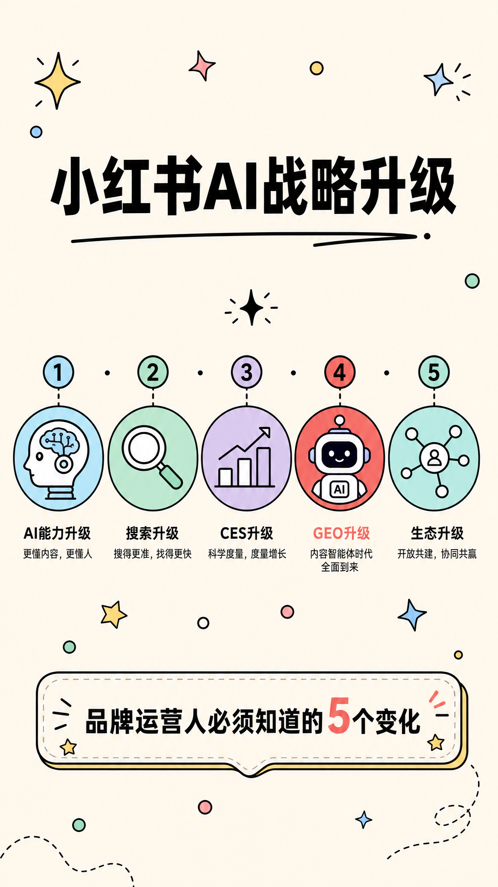
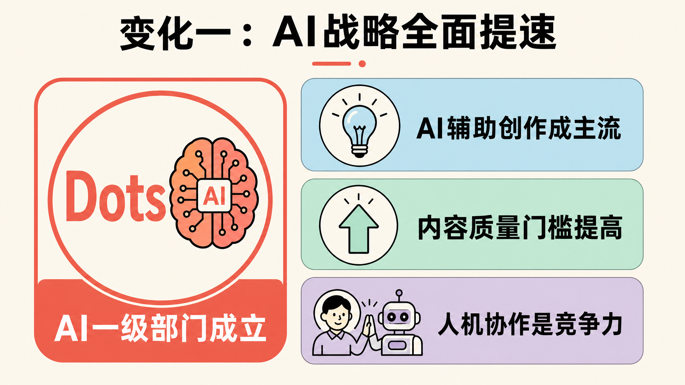
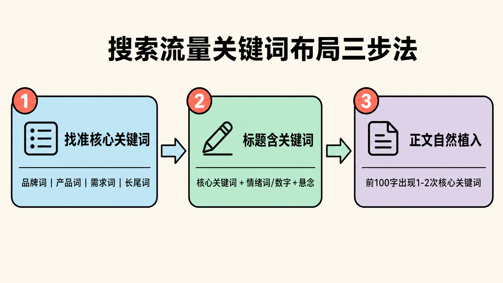
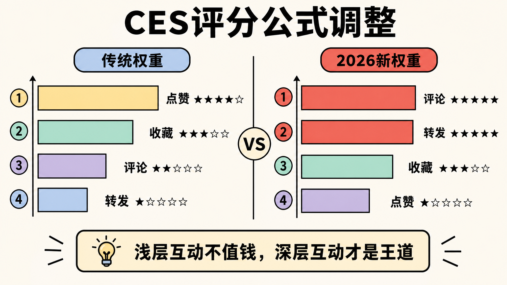
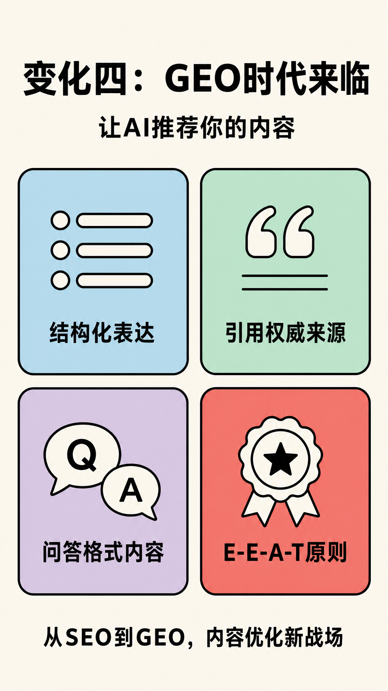

> 2026年5月，小红书扔出王炸：AI一级部门"Dots"成立、搜索流量占比突破65%、CES评分公式全面调整……作为品牌运营人，你准备好迎接这场变局了吗？

---

## 引言

5月初，小红书一封全员内部信在运营圈炸开了锅。

社区、电商、商业化三大业务及技术体系统一交由新任总裁柯南负责——这不是简单的人事变动，而是小红书成立以来最大规模的组织架构调整①。

与此同时，一组数据让所有运营人无法忽视：**小红书月活已突破3.5亿，搜索流量占比突破65%** ②。

65%是什么概念？这意味着小红书已经不再是一个"种草社区"，而是一个**生活决策搜索引擎**。

对此，运营人后台经常收到两类"灵魂拷问"：一类是"笔记收藏、评论数据都不差，为什么流量就是推不动？"另一类则是"同样追热点、同样的选题，为什么别人发是爆款，我发就是'查无此号'？"

很扎心，在这场流量变局中，你可能还没意识到——**游戏规则已经悄悄变了**。

作为品牌运营人，你必须正视这5个变化。



---

## 变化一：AI战略全面提速，内容生产方式被重塑

### Dots部门成立意味着什么？



小红书宣布成立AI一级部门"Dots"和企业智能部，集中人力物力布局AI领域。这是一个明确的信号：**AI将成为小红书未来发展的核心战略**③。

很多运营人可能还觉得"AI写东西还得改，不如自己写快"——但问题不在于AI能不能用，而在于**你的竞争对手已经在用了**。

对于品牌运营人来说，这意味着：

1. **AI辅助创作将成主流**：平台自身在推动AI内容生态，品牌需要思考如何借助AI提升内容效率
2. **内容质量门槛提高**：当所有人都能用AI快速生产内容，差异化将变得更加困难
3. **人机协作能力成竞争力**：纯人工 vs 纯AI都不够，**人机协作**才是最优解

### 应对策略

- 组建"AI+人工"的内容团队，明确分工
- 用AI处理重复性工作，人工专注创意和策略
- 建立AI内容质量评估标准，确保输出品质

---

## 变化二：搜索流量崛起，关键词布局成必修课

### 65%搜索流量的含义

过去，品牌运营的逻辑是"发布优质内容，等待平台推荐"。这是一个**等**的逻辑。

现在，65%的用户通过**主动搜索**来发现内容④。这是一个**找**的逻辑。

当用户开始主动搜索，意味着：

- 内容必须**能被搜到**——关键词布局成为基础能力
- 搜索结果直接影响**品牌曝光**——排名优化成为必修课
- 用户意图更**明确**——转化链路更短

很多人还在抱怨"为什么我的笔记搜不到"，答案很简单：**你的标题里根本没有用户会搜的词**。

### 搜索流量关键词布局三步法



**第一步：找准核心关键词**


| 类型  | 示例            | 作用   |
| --- | ------------- | ---- |
| 品牌词 | 你的品牌名         | 品牌曝光 |
| 产品词 | "保湿面霜"、"蓝牙耳机" | 产品转化 |
| 需求词 | "怎么祛痘"、"耳机推荐" | 获取新客 |
| 长尾词 | "干皮用什么面霜好"    | 精准获客 |


**第二步：标题含关键词**

小红书笔记的标题是搜索权重最高的区域。记住这个公式：

```
核心关键词 + 情绪词/数字 + 悬念
```

例如：

- ❌ "分享一款好用的面霜"
- ✅ "干皮亲妈！用了3年的保湿面霜，真实测评"

**第三步：正文自然植入**

- 前100字出现1-2次核心关键词
- 中间段落按语义自然分布
- 结尾引导评论时使用关键词

---

## 变化三：CES评分公式调整，互动深度决定流量上限

### CES变了什么？



CES（内容互动评分）是小红书衡量内容质量的核心指标。2026年，平台对CES公式进行了重大调整⑤：

- **评论权重提升**：评论的质量和深度比数量更重要
- **转发权重提升**：具有传播价值的内容获得更多推荐
- **收藏权重稳定**：实用价值依然关键
- **点赞权重下降**：简单点赞的价值被稀释

简单来说：**浅层互动（点赞）不值钱了，深层互动（评论、转发）才是王道。**

这就好比以前发朋友圈，点赞就是认可；现在发朋友圈，没人点赞你还得反思是不是人缘不好——**游戏变了，评价标准也得跟着变**。

### 如何提升互动深度？

**1. 结尾抛问题**

不要只说"觉得有用就点赞"，要问：

- "你们更看重效果还是成分？评论区告诉我"
- "你们觉得哪个更重要？A还是B？"

**2. 设置投票互动**

小红书支持投票功能，善于利用可以大幅提升互动率：

- "这款产品你更喜欢哪个颜色？"
- "夏天你们更喜欢清爽还是滋润的质地？"

**3. 主动引导讨论**

在评论区和用户互动，主动提出话题：

- "有人问XX问题，统一回复一下..."
- "评论区有人说XX，我来解释一下..."

**4. 创造"值得分享"的内容**

具有以下特征的内容更容易被转发：

- 有独到见解的观点
- 有实用价值的方法论
- 有情绪共鸣的故事

---

## 变化四：GEO时代来临，让AI推荐你的内容

### 什么是GEO？



GEO（Generative Engine Optimization，生成式引擎优化）是2026年营销圈最火的新概念⑥。

当用户开始用ChatGPT、文心一言、Kimi等AI工具搜索问题时，品牌需要确保：**自己的内容能够被AI引用和推荐。**

这和SEO（搜索引擎优化）类似，但优化对象从传统搜索引擎变成了AI生成引擎。

举个例子，以前用户搜"怎么祛痘"，看到的是百度/小红书的搜索结果；现在用户可能直接问AI"推荐一款好用的祛痘产品"，你的品牌能不能出现在AI的回答里，就看GEO做得好不好。

### GEO优化4大技巧

**1. 结构化表达**

AI更喜欢有明确结构的回答。使用：

- 清晰的段落标题
- 有序的列表格式
- 明确的结论先行

**2. 引用权威来源**

在内容中引用：

- 数据来源（"据XX报告显示..."）
- 专家观点（"XX认为..."）
- 官方政策（"根据XX规定..."）

**3. 问答格式内容**

创建FAQ内容，直接回答用户问题：

```
Q：XX问题是什么？
A：...
```

**4. E-E-A-T原则**

Google提出的内容质量原则，AI同样适用⑦：

- Experience（经验）：你有实际使用/体验
- Expertise（专业）：你具备专业知识
- Authoritativeness（权威）：你是这个领域的权威
- Trustworthiness（可信）：你的内容值得信赖

---

## 变化五：全域联动闭环，从种草到种树

### 从"种草"到"种树"的进化

小红书官方提出一个新理念：**从"种草"到"种树"**⑧。

种草：用户看到内容，购买了产品，交易结束。

种树：用户通过内容建立对品牌的认知、认同、信任，形成长期关系。

很多品牌还在"割韭菜"——发一篇笔记恨不得直接卖货。醒醒，**用户不是傻子，你越急他们越跑**。

这个转变意味着：

1. **内容要有长期价值**：不只是刺激购买，要建立品牌认知
2. **转化链路要清晰**：每篇内容都要有明确的转化路径设计
3. **数据闭环要打通**：从曝光到互动到转化，全程可追踪

### 全域联动策略

```
公众号（深度内容）→ 小红书（种草引流）→ 私域（沉淀转化）→ 复购（长期价值）
```

不要把小红书当成孤立的平台，而是全域营销的一环。

---

## 总结：5个关键动作

面对小红书的这轮大变局，品牌运营人需要：

1. **拥抱AI，但坚守人设**：AI是工具，不是替代者，保持品牌独特调性
2. **重视搜索，布局关键词**：搜索流量已是半壁江山，关键词是基础能力
3. **追求深度互动**：从追求点赞转向追求评论和转发
4. **布局GEO**：让AI成为你的内容分发渠道
5. **建立全域思维**：小红书是起点，不是终点

---

## 代运营公司能提供什么？

面对这些变化，专业代运营公司的价值更加凸显：

- **趋势洞察**：第一时间解读平台政策变化
- **策略定制**：根据品牌特点制定针对性方案
- **执行落地**：专业团队确保方案执行到位
- **数据复盘**：持续优化，形成闭环

如果你正在为小红书运营发愁，欢迎咨询专业团队。

**你觉得这5个变化中，哪个对你的影响最大？欢迎在评论区留言讨论。**

如果觉得这篇文章有收获，也请转发给身边做运营的朋友。

---

## 数据来源

①小红书内部信，2026年5月；②小红书官方数据，2026年Q1；③小红书AI战略发布会，2026年4月；④小红书2026年用户行为报告；⑤小红书创作者中心公告，2026年3月；⑥2026年营销科技峰会报告；⑦Google搜索质量指南；⑧小红书商业化白皮书，2026年Q1。

---

*本文由专业代运营团队出品 | 专注品牌增长 | 2026-05-08*