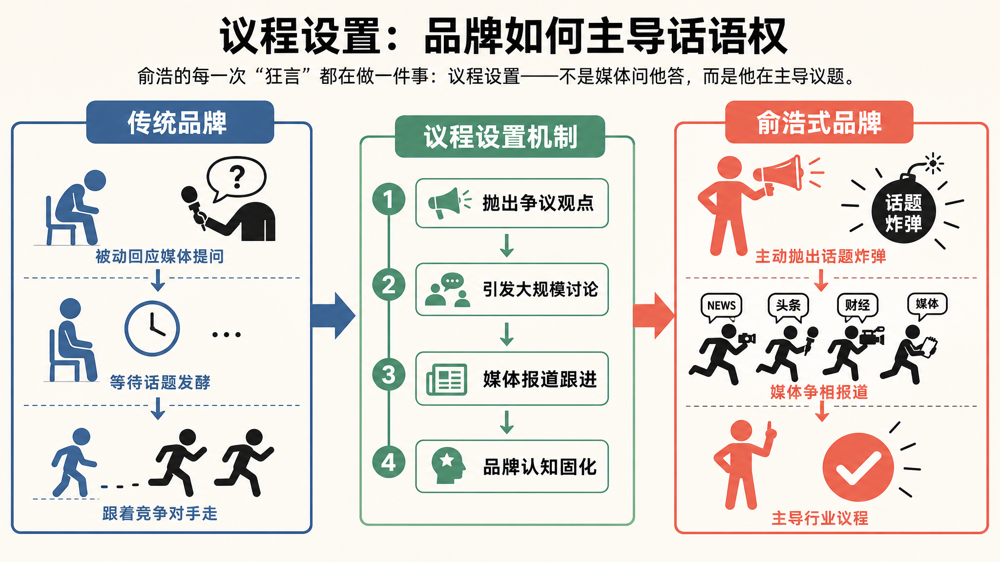
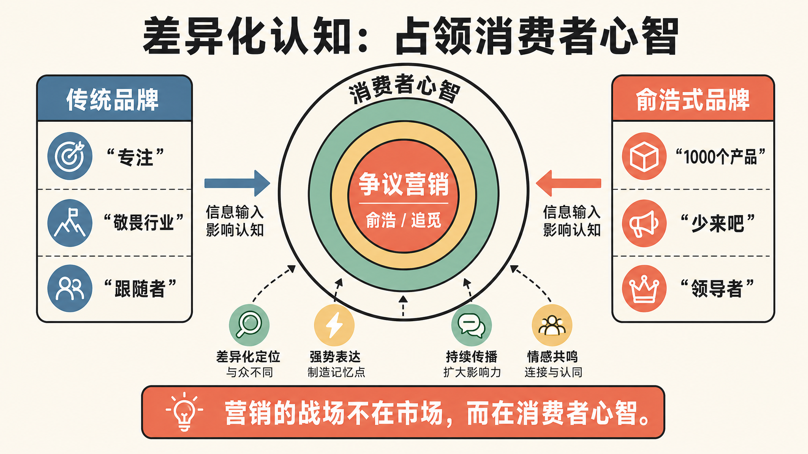

> 炮轰平台、喊话巨头：这位清华学霸正在重新定义"品牌说话的方式"

---

## 引言

追觅创始人俞浩，又上热搜了。

4月28日，他在微博连发数条，公开炮轰小红书——"为什么你们的算法把差评往前推？请公开算法逻辑和盈利模式。"

这不是俞浩第一次"开炮"。早在2026年初，他就放言追觅手机要"与华为、小米三分天下"；造车要对标布加迪；三年目标要实现营收万亿。

有人说他是疯子，有人说他是营销鬼才。

但如果只把俞浩当作一个"嘴炮"，那你可能错过了更重要的东西。

作为一个在代运营行业摸爬滚打多年的观察者，我更关心的是：**俞浩式的表达，到底能给品牌运营带来什么启示？**

今天这篇文章，我试着从他的争议言论中，提炼出3个可复用的品牌表达策略。

---

## 01 不要害怕争议，害怕的是没有立场

**大多数品牌做内容的最大问题，不是怕说错话，而是不敢说话。**

每周选题会，我最常听到的顾虑是："这个观点会不会太激进了？""这个角度会不会引发争议？"

结果呢？产出的内容四平八稳，看完即忘，没有任何传播势能。

俞浩恰恰相反。他从不掩饰自己的观点。炮轰小红书算法，他直接@官方要求回应；跨界造车，他直接喊出"对标布加迪"；手机市场，他直接放话"与华为小米三分天下"。

> "在自主品牌能做成之前，我同时做米家和自主品牌，而不赌自主品牌一定能成功。"
> ——俞浩

**有立场的表达，永远比四平八稳的废话更有传播价值。**

俞浩深谙此道。他的每一次"狂言"，都在做一件事：**议程设置**——不是媒体问他答，而是他在主导议题。

---

## 02 "狂"不是目的，差异化认知才是

有人会说：俞浩的言论太极端了，普通品牌学不来。

这话对了一半。

俞浩的"狂"背后，有一层更深的逻辑——**他在抢占一个独特的认知位置。**

当所有科技公司都在说"我们敬畏行业"的时候，俞浩站出来说"少来吧"；当所有创业者都在说"我们要专注"的时候，俞浩站出来说"我们要做1000个产品"。

> "提到'争议营销'，你开始想到俞浩和追觅。"

营销大师特劳特说过：**"营销的战场不在市场，而在消费者心智。"**

俞浩深谙此道。他的每一次"狂言"，都在往追觅的"差异化认知"储钱罐里投币。

**不要为了"狂"而"狂"，而是思考：你的品牌想在消费者心智中占据什么位置？**

---

## 03 真性情比"端着"更有穿透力

最后一个观察，可能有点反直觉。

俞浩的言论之所以有传播力，不仅仅因为"狂"，更因为"真"。

> "我之前会刻意把自己想的翻译成另一套语言，那非常耗能。我不喜欢那样，现在怎么想就怎么说。"
> ——俞浩

他甚至承认，早年创业时什么能挣钱就干什么，充电宝都做过。"真实是最不动人的故事，但我们就是这么过来的。"

在内容过剩的时代，消费者对"品牌腔调"的敏感度越来越低，但对"真实感"的需求越来越高。那些"端着"的内容，看起来完美，但总感觉隔了一层。

**真性情的内容，可能不完美，但一定更有穿透力。**

---

## 结论

俞浩的争议言论，给品牌运营带来3个启示：

**1. 不要害怕争议，害怕的是没有立场。**
有立场的表达，比四平八稳的废话更有传播价值。

**2. "狂"不是目的，差异化认知才是。**
争议只是手段，占领消费者心智才是目的。

**3. 真性情比"端着"更有穿透力。**
真实的内容可能不完美，但一定更有信任感。

当然，这三个策略都有前提：**你的产品和服务要经得起检验。**

俞浩敢"狂"，是因为追觅的产品确实在全球市场站稳了脚跟——海外营收占比78%，进入120多个国家，高速马达转速超越戴森。

**争议是放大器，不是替代品。放大的是品牌实力，替代不了产品本身。**

---

**行动清单：**

1. **下次选题会，先问立场**：团队想传达的核心观点是什么？
2. **找到差异化认知位置**：你的品牌想占据什么关键词？
3. **检查内容的真实感**：这句话是你真心想说的吗？
4. **用争议检验**：如果你的观点引发争议，那说明它有传播势能

---

**数据来源**

- 追觅海外营收占比78%，进入全球超120个国家和地区 | 腾讯新闻《俞浩的追觅帝国》 | 2026-04-30
- 俞浩炮轰小红书算法事件 | 晚点LatePost《对话追觅俞浩：我的真实世界》 | 2026-04-20
- 追觅高速马达转速超越戴森 | 公开报道整理

---

*本文由Holamuse团队出品 | 专注合规运营*