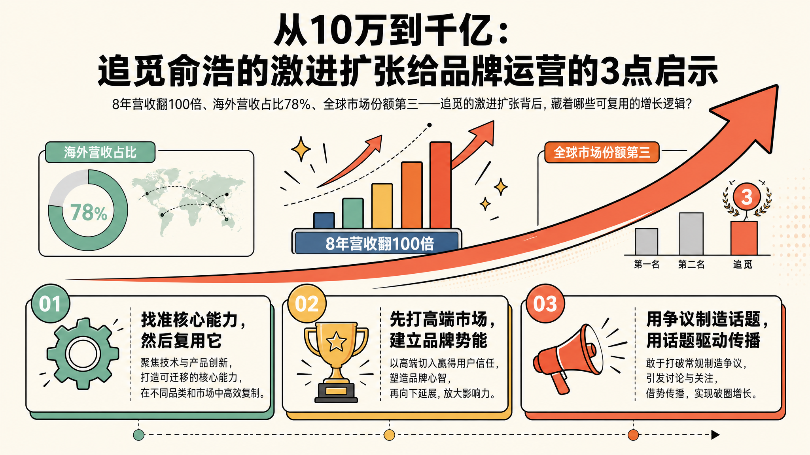
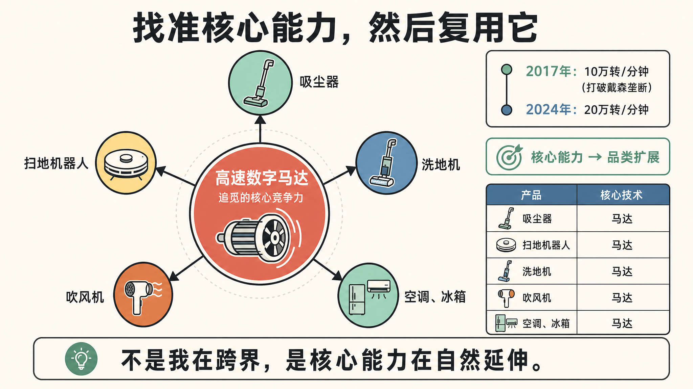
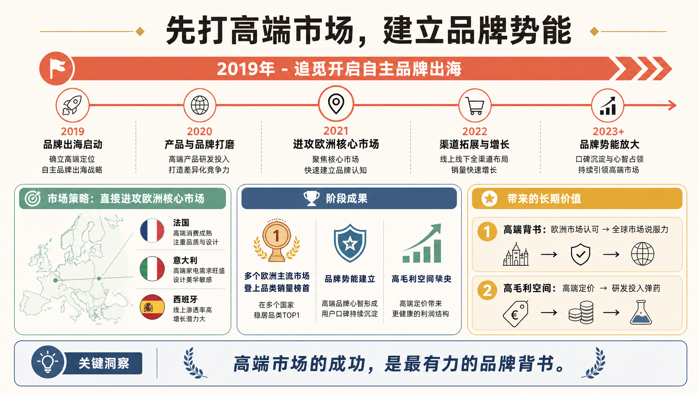
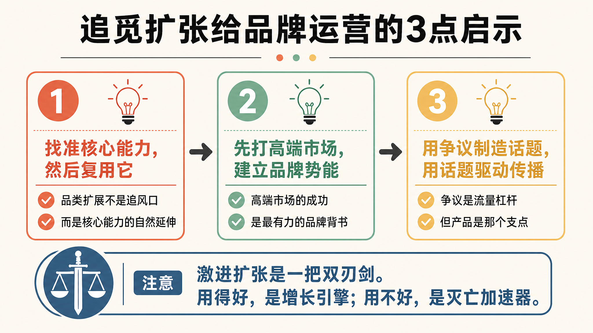

> 8年营收翻100倍、海外营收占比78%、全球市场份额第三——追觅的激进扩张背后，藏着哪些可复用的增长逻辑？

一个数字，足以说明追觅这家公司的特殊：

**10万——这是追觅创业初期的启动资金。**

2017年，俞浩带着这笔钱和几个同学，创办了追觅科技。8年后，这家公司年营收已经逼近千亿，成为全球智能清洁市场的第三名。

支撑这个增长的，是一次次"激进"的决策：从代工转向品牌，从国内转向海外，从清洁电器转向手机、汽车、大家电。

每一次扩张，都伴随着俞浩的"狂言"：对标戴森、叫板华为、挑战布加迪……

有人说他疯了，有人说他赌性太重。

但如果我们认真拆解追觅的扩张路径，会发现**激进背后，有一套可复用的增长逻辑。**

今天这篇文章，我从运营视角提炼出3点启示，供品牌运营者参考。

---

## 01 找准核心能力，然后复用它

追觅扩张的第一个关键决策，是**找准了核心能力，然后围绕它做品类扩展。**

追觅的核心能力是什么？

**高速数字马达。**

这是追觅的起家技术。2017年，他们用10万资金研发出10万转/分钟的高速马达，打破了戴森长达十余年的垄断。2024年，这个数字提升到了20万转/分钟。

基于这个核心能力，追觅做了品类扩展：

- 吸尘器 → 核心是马达
- 扫地机器人 → 核心是马达
- 洗地机 → 核心是马达
- 吹风机 → 核心是马达
- 空调、冰箱 → 核心还是马达

俞浩的逻辑是：**不是我在跨界，是核心能力在自然延伸。**

**核心能力复用，是激进扩张的安全垫。**

---

## 02 先打高端市场，建立品牌势能

追觅全球化的第二个关键决策，是**先打高端市场。**

2019年开启自主品牌出海时，追觅没有选择"先易后难"，而是直接进攻欧洲核心市场——法国、意大利、西班牙。

结果呢？追觅的扫地机器人和吸尘器，迅速在多个欧洲主流市场登上品类销量榜首。

这带来两个好处：

**好处一：高端背书**

欧洲市场的认可，为追觅在全球其他市场建立了品牌势能。一个能在法国打败本土品牌的公司，在其他市场当然更有说服力。

**好处二：高毛利空间**

高端市场的定价更高，带来更好的毛利空间，为后续的研发投入和价格战提供弹药。

**高端市场的成功，是最有力的品牌背书。**

---

## 03 用争议制造话题，用话题驱动传播

追觅传播的第三个关键决策，是**主动制造争议话题。**

俞浩的"狂言"不是失控的嘴炮，而是一套精心设计的传播策略：

- "追觅手机要与华为、小米三分天下" → 媒体不得不报道追觅的手机战略
- "追觅汽车要对标布加迪" → 市场不得不关注追觅的汽车野心
- "炮轰小红书算法" → 创作者不得不讨论平台生态问题

每一次"狂言"，都在制造话题；每一个话题，都在驱动传播。

**争议是流量杠杆，但杠杆需要支点——你的产品就是那个支点。**

---

## 结论

追觅的激进扩张，给品牌运营者3点启示：

**1. 找准核心能力，然后复用它**
品类扩展不是追风口，而是核心能力的自然延伸

**2. 先打高端市场，建立品牌势能**
高端市场的成功，是最有力的品牌背书

**3. 用争议制造话题，用话题驱动传播**
争议是流量杠杆，但产品是那个支点

当然，追觅的策略不是没有风险。核心高管流失、国内市场份额下滑、融资空窗……这些问题都在提醒我们：

**激进扩张是一把双刃剑。用得好，是增长引擎；用不好，是灭亡加速器。**

对于普通品牌而言，不必模仿追觅的"狂"，但可以学习它的"逻辑"。

---

**数据来源**

- 追觅启动资金10万元，2017年成立 | 腾讯新闻《俞浩的追觅帝国》 | 2026-04-30
- 追觅高速马达转速20万转/分钟（2024年） | 公开报道整理
- 追觅海外营收占比78%，进入全球超120个国家和地区 | 腾讯新闻《俞浩的追觅帝国》 | 2026-04-30
- 追觅全球市场份额第三（10.5%） | 行业报告整理

---

*本文由Holamuse团队出品 | 专注合规运营*