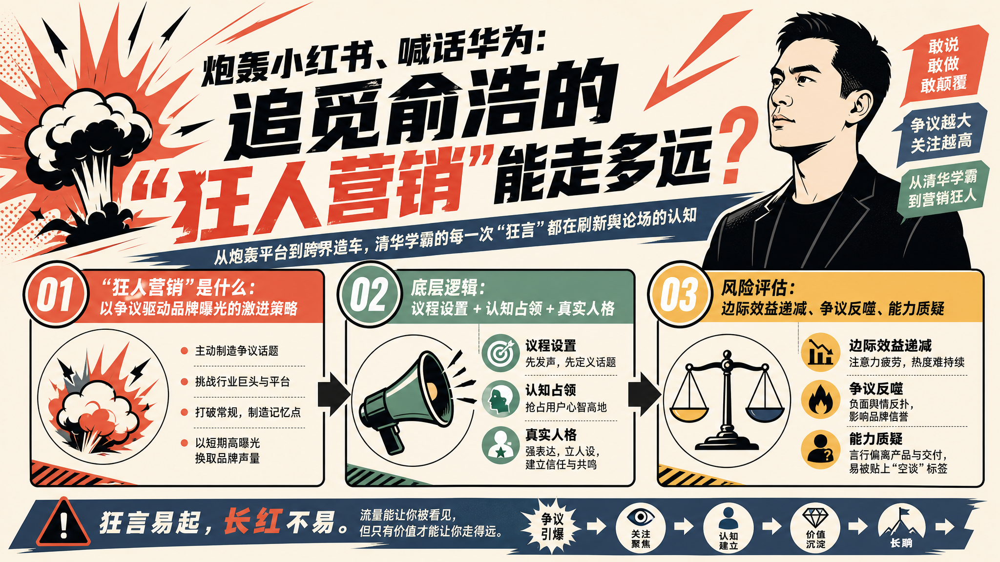
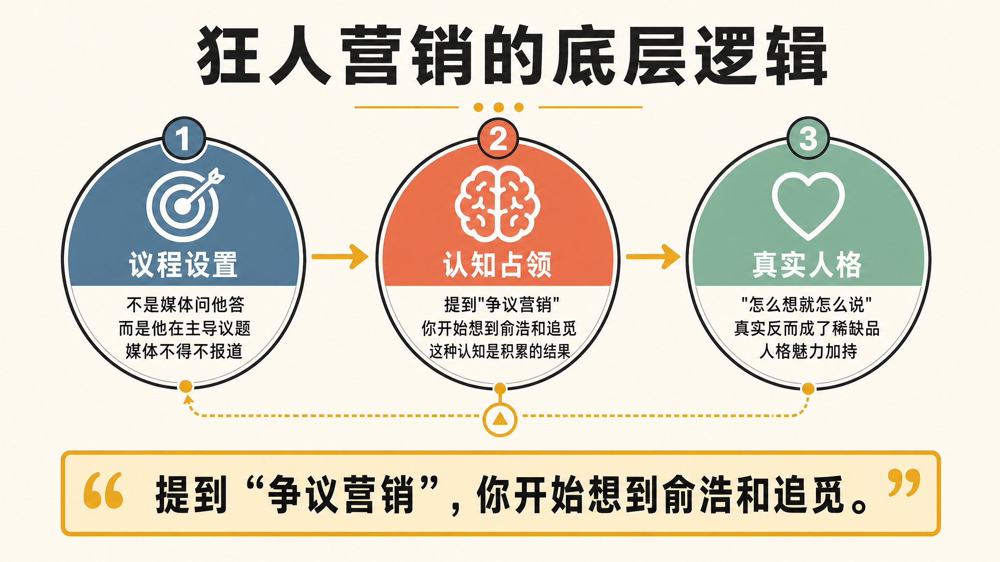
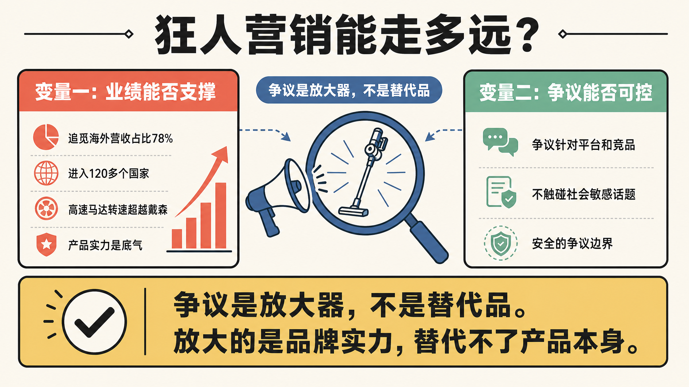

> 从炮轰平台到跨界造车，这位清华学霸的每一次"狂言"都在刷新舆论场的认知

---

## 引言

追觅创始人俞浩，又双叒叕上热搜了。

4月28日，他在微博连发数条，公开炮轰小红书——"为什么你们的算法把差评往前推？请公开算法逻辑和盈利模式。"

这已经不是他第一次语出惊人了。

2026年初，他说追觅手机要"与华为、小米三分天下"；造车要"对标布加迪"；三年后追觅要实现营收万亿。

每一次"狂言"都精准击中舆论兴奋点，引发大规模讨论。

有人说他是"营销鬼才"，每一次发言都是免费广告；有人说他"太狂了"，迟早要栽跟头；还有人干脆称之为"狂人营销"——一种以争议驱动品牌曝光的激进策略。

但"狂人营销"真的能长期奏效吗？

今天，我们不吹不黑，从运营视角认真分析一下。

---

## 01 "狂人营销"是什么？

要理解俞浩的做法，先要理解这个概念。

简单来说，这是一种以制造争议话题为核心的传播策略。核心逻辑是：

**在信息过载的时代，与其四平八稳地说话，不如抛出一些"炸弹"，引爆舆论。**

俞浩深谙此道。他的每一次"狂言"，都具备三个特征：

**1. 话题性**：直接点名竞争对手或平台，引发争议
**2. 极端性**：目标设定极度大胆，超越常规认知
**3. 可传播性**：金句频出，适合截图传播

效果呢？追觅这个品牌，从一个扫地机器人公司，变成了一个有"人格"的品牌——激进、敢言、不按常理出牌。

这种人格化认知，是多少广告费都买不来的。

---

## 02 狂人营销的底层逻辑

但如果你以为俞浩只是在"博眼球"，那就太简单了。

他的"狂"背后，有一套清晰的传播逻辑。

**逻辑一：议程设置**

传播学上有个概念叫"议程设置"——媒体会报道什么，很大程度上取决于有人提出了什么话题。

俞浩的每一次"狂言"，都在定义议题：不是媒体问他答，而是他在主导议题。

**逻辑二：认知占领**

营销大师特劳特说过：**"营销的战场不在市场，而在消费者心智。"**

提到"性价比"你会想到小米，提到"高端"你会想到苹果，提到"争议营销"你开始想到俞浩和追觅——这种认知，是一次次"狂言"积累的结果。

**逻辑三：真实人格**

> "我之前会刻意把自己想的翻译成另一套语言，那非常耗能。我不喜欢那样，现在怎么想就怎么说。"
> ——俞浩

这种"真"，反而成为了一种人格魅力。在品牌普遍"端着"的时代，真实反而成为了稀缺品。

---

## 03 狂人营销的风险

但"狂人营销"真的是万能的吗？

当然不是。

**风险一：边际效益递减**

第一次抛出"狂言"，媒体争相报道；第十次，可能就没人当回事了。

**风险二：争议反噬**

争议是一把双刃剑。喜欢的人越来越喜欢，讨厌的人越来越讨厌。

**风险三：能力质疑**

"狂言"最终需要"业绩"来背书。如果追觅的核心业务出现下滑，那些曾经的"狂言"就会变成质疑的把柄。

---

## 04 能走多远？

回到最初的问题：追觅俞浩的"狂人营销"能走多远？

**取决于两个变量。**

**变量一：业绩能否支撑**

俞浩敢"狂"，是因为追觅的产品确实在全球市场站稳了脚跟——海外营收占比78%，进入120多个国家，高速马达转速超越戴森。

**变量二：争议能否可控**

俞浩的聪明之处在于，他的争议针对的是平台和竞品，而非触碰社会敏感话题。这种"安全"的争议，维持在一个可控的范围内。

---

## 结论

追觅俞浩的"狂人营销"，不是简单的博眼球，而是一套经过设计的传播策略：

1. **议程设置**：主动定义议题，而非被动回应
2. **认知占领**：抢占独特的心智位置
3. **真实人格**：用真性情建立信任

它的风险在于边际效益递减、争议反噬、能力质疑。

**对品牌运营者的启示：**

- 不要害怕争议，害怕的是没有立场
- 主动制造话题，而非被动蹭热度
- 争议要围绕核心定位，而非为了博眼球
- 真性情比"端着"更有穿透力

当然，这一切的前提是：**你的产品和服务，要经得起检验。**

---

**数据来源**

- 追觅海外营收占比78%，进入全球超120个国家和地区 | 腾讯新闻《俞浩的追觅帝国》 | 2026-04-30
- 俞浩炮轰小红书算法事件 | 晚点LatePost《对话追觅俞浩：我的真实世界》 | 2026-04-20

---

*本文由Holamuse团队出品 | 专注合规运营*
