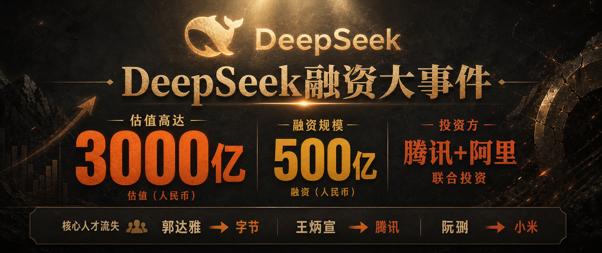
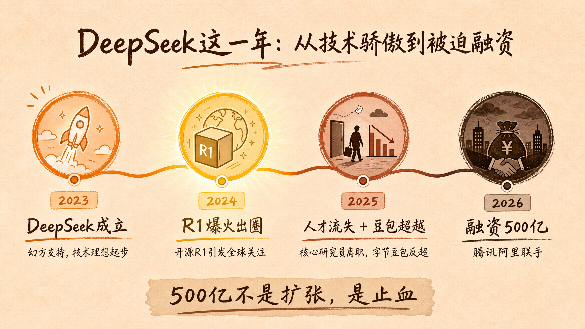

> 当开源侠客开始为钱发愁
---

DeepSeek刚刚融了500亿。估值3000亿。腾讯和阿里联手入局。

按理说，这应该是科技圈普天同庆的消息。但你仔细看这轮融资的结构，会发现一个让人后背发凉的事实：这500亿里，200亿是梁文峰自己掏的。

自己掏200亿来融资，说明什么？说明他不想被稀释，但更说明他不得不融。

DeepSeek的焦虑，从这一刻就开始了。

---

## 全网都在说DeepSeek厉害，但梁文峰正在经历创业以来最焦虑的时刻

这不是标题党。来看几个事实：

**人才流失。** 2025年，DeepSeek三名核心研究员相继离职：郭达雅去了字节跳动，王炳宣去了腾讯，阮翀去了小米。这三个人，是DeepSeek能做出R1的关键。梁文峰说过，他只招最优秀的人。但问题是，最优秀的人，也是大厂最想挖的人。一家200人的公司，给不起千万年薪，也给不起足够的股票空间。

**被豆包反超。** DeepSeek曾经是国产AI的骄傲，R1发布那天，整个科技圈都在刷屏。但半年后，豆包的用户量已经超过了DeepSeek。你以为你领先了，其实字节每天烧两个亿在追你。

**商业化压力。** 梁文峰一直说"不急着商业化，先把技术做到世界领先"。这话在2025年之前没问题。但现在，他承诺2026年必须盈利，V4.1版本6月就要发布。整个行业都在等他证明：开源模型也能赚钱。

500亿融资，表面是扩张，实际上是止血。

---

## 梁文峰到底是一个怎样的人？

聊DeepSeek，没法不聊梁文峰。他可能是国内最有IP潜力、但最低调的AI公司创始人。

浙大电子信息工程硕士，幻方量化创始人。幻方是国内最成功的量化私募之一，管理规模上千亿。从量化到AI，这条路听起来跳跃，但实际上逻辑很顺——都是用数学和算法理解世界。

梁文峰有一个特别鲜明的人设：**技术理想主义者**。

他坚定认为开源才是AI的未来。他的原话是："开源是AI发展的正确方向，闭源只会延缓进步。"这话听起来像情怀，但你仔细看DeepSeek的实际动作：R1开源、Coder开源、Math开源，每一次发布都把模型权重公开给社区。别人在卖API赚钱，他在免费送代码。

开发者社区自发地称他为"AI侠客"。这个称呼不是营销出来的，是社区真实情感的表达。

但侠客也有侠客的困境。

当人才被大厂用高薪挖走，当豆包用户量开始反超，当投资人要求看到商业化路径，技术理想主义者也要面对一个现实问题：**开源的理想，靠什么来养活？**

这个问题，比融多少钱更重要。

---

## AI淘汰赛，没有旁观席

腾讯和阿里联手投资DeepSeek，是一件有历史意义的事。这两家平时互相抢用户的巨头，居然一起出现在了同一个被投方的股东名单上。

DeepSeek的估值3000亿，是目前中国AI企业的最高估值之一。这个数字背后，是一个残酷的逻辑：**AI竞争的门槛，已经高到只有顶级资本才玩得起。**

500亿只是个起步价。

真正烧钱的部分是：算力。V4模型参数量向万亿级突破，训练一次的成本是天文数字。人才。核心AI人才年薪动辄千万，中小公司根本无力承担。用户。豆包日均Token调用量120万亿，每天的推理成本都是亿元级别。

这不是普通创业公司的游戏，甚至不是普通大公司的游戏。这是国家级的军备竞赛。

对于普通人，淘汰赛意味着什么？

你可能在某天早上醒来，突然发现公司裁员了，因为AI效率更高了。你花了三年学的技能，可能在下个月发布的新模型面前变得一文不值。你今天引以为傲的效率优势，可能在六个月后被一个更便宜的AI工具追平。

说实话，做运营这几年，我自己焦虑过。但后来我想明白了——焦虑AI会不会取代你，不如焦虑你的判断力值多少钱。

---

## 当AI大佬都在焦虑，普通人怎么办？

我做运营这几年，见过两种人。

一种人每天追着AI新闻跑：DeepSeek又发布新模型了，ChatGPT又更新了，豆包又收费了。每次新闻出来就开始焦虑：AI是不是又要取代我的工作了？然后继续刷新闻，继续焦虑。

另一种人从来不追新闻，但他们每天都在用AI。每天用AI写内容，用AI做数据分析，用AI处理那些重复性的工作。他们不焦虑AI会不会取代他们，他们只焦虑一件事：我的判断力够不够用？

梁文峰说过一句话，我觉得是这整件事里最有价值的一句话：

"AI是未来，但未来属于谁？"

我的答案是：**未来属于那些知道AI擅长什么、不擅长什么的人。**

AI最擅长的是：重复劳动、模式识别、信息整合。

AI最不擅长的是：判断价值、理解人性、在模糊中做决策。

运营行业尤其如此。AI可以帮你写10篇笔记，但哪篇值得花预算推流，需要人来判断。AI可以帮你分析1000条数据，但这些数据背后用户真正想要什么，需要人来洞察。AI可以批量生成内容，但内容的调性、品牌的一致性、受众的情感共鸣，这些东西AI到现在还是做不好。

梁文峰在焦虑融资500亿怎么花，我们普通人应该焦虑的是：我的判断力，值多少钱？

---

## 最后说一句

DeepSeek融资500亿，是国产AI的高光时刻，也是AI淘汰赛的正式开幕。

梁文峰在用开源对抗闭源，用技术对抗商业，用理想对抗现实。他能不能成功，我不知道。但他提出的那个问题——开源的理想，靠什么养活——我觉得不只是DeepSeek的问题，是整个AI行业都需要回答的问题。

作为普通人，我们能做的不是预测谁赢谁输，而是在这场淘汰赛里，找到自己不可替代的位置。

毕竟，当梁文峰都开始焦虑融资的时候，你我还有什么资格不焦虑自己的判断力？

---

**数据来源**

- DeepSeek融资金额500亿，估值3000亿 | 21经济网 | 2026年4月
- 腾讯+阿里联合投资18亿美元 | 观点网 | 2026年4月
- 梁文峰融资出资200亿元 | 搜狐财经 | 2026年
- 核心人才流失：郭达雅→字节、阮翀→小米、王炳宣→腾讯 | 21经济网 | 2025年
- 豆包日均Token调用量120万亿 | 综合数据 | 2026年3月

---

*本文由Holamuse团队出品 | 专注合规运营*
