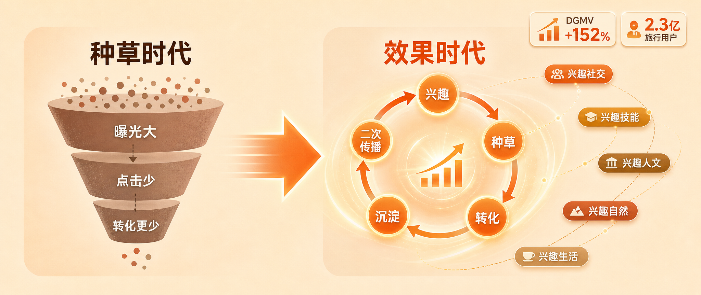
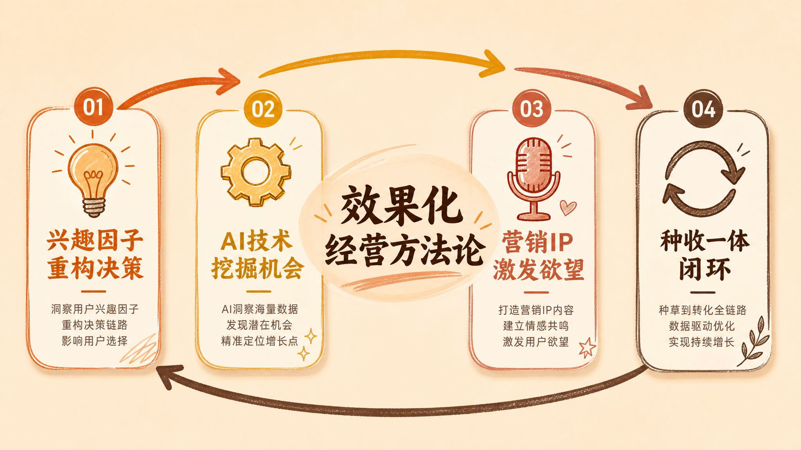

> 运营的机会，在"兴趣"两个字里

---

小红书的文旅峰会，主题是八个字：兴趣所向，生意所往。

听起来像一句公关口号。但你仔细拆解这八个字，会发现它是过去三年内容营销逻辑的一次彻底重构。

以前的逻辑是：先决定去哪，再找攻略。

新的逻辑是：先有生活兴趣，再找对应的目的地。

这两件事看起来差不多，但它们背后的内容生产逻辑，完全不同。

---

## 五大兴趣标签，藏着流量密码

峰会发布了小红书文旅的五大兴趣类别：兴趣社交、兴趣技能、兴趣人文、兴趣自然、兴趣生活。

我专门翻了一下这五个类别的含义，发现这不是一个简单的分类，它是用户决策逻辑的重新定义。

**兴趣社交**的核心不是"去哪里"，而是"和谁去"。朋友组队打卡、网红地探店，本质上是在满足社交需求，顺便完成了旅行。景区能不能提供"拍照好看"的价值，比能不能提供"风景好"的价值更重要。

**兴趣技能**是这两年增长最快的类目。冲浪、滑雪、潜水、考证——用户去某个地方，不是因为那个地方本身，而是因为在那里可以学会某项技能。学完之后，他们会把"我在某地学会了某项技能"当成一种社交货币来分享。这个逻辑下，内容不需要写得多美，而是需要写清楚"学什么、去哪学、有多难"。这比传统的景点介绍难多了，但也好做多了——因为框架清晰，你知道用户真正想看什么。

**兴趣人文**是非遗体验、历史探访、艺术展览。这个类目天然适合有深度的内容，也天然适合转化高客单价的文旅产品。我见过最聪明的内容打法是：把一个博物馆做成"探秘"系列，把一次非遗体验做成"穿越"故事。内容成本不高，但调性立刻就上去了。

**兴趣自然和兴趣生活**的逻辑更直接：徒步露营是兴趣，旅居数字游民也是兴趣。这两个类目的用户有一个共同特点：他们不是来"打卡"的，是来"生活"的。他们愿意为一篇真实、有细节的攻略等上三个月。

理解这五个类目，比记住这五个名字重要得多。因为这五个类目，是接下来一年小红书文旅内容创作的核心框架。

---

## 效果化经营：这次小红书是认真的

峰会更重要的一个信号，是小红书正式发布了"效果化经营"方法论。

翻译成人话就是：以前你做好内容，我来给你曝光；现在我给你曝光，你得给我看到转化。

这不是平台单方面的贪婪，这是市场逼出来的选择。

小红书官方公布了一个数据：过去一年，小红书文旅成交单量增长92%，DGMV（商品成交总额）增长152%。这个数字说明什么？说明在小红书被"种草"的旅行用户，已经开始习惯在平台内完成交易了。用户不只是在小红书看攻略，他们已经开始在小红书下单了。

效果化经营的四大核心策略：

**兴趣因子重构旅行决策。** 不是告诉用户"这里有多好玩"，而是告诉用户"这里能让你成为什么样的人"。你会冲浪，和你会滑雪，在小红书上的内容价值完全不同。

**AI技术挖掘新机会。** AI辅助内容创作、AI数据分析用户行为、AI客服响应——这些不是PPT上的概念，是已经被验证过的效率工具。AI笔记生成可以把一篇攻略的产出时间压缩到原来的三分之一，AI数据分析可以发现哪些内容的收藏率高但转化率低。

**营销IP激发出行欲望。** 平台级的营销IP——"小红书过夏天"、"小红书徒步季"——本质上是在创造用户"必须参与"的理由。运营的机会在于：提前布局，跟着平台IP走，能拿到比平时更多的自然流量。

**种收一体闭环。** 种草是为了转化，但转化不一定要闭环。奢游国际的案例很有意思：他们通过小红书获客，咨询量做到百万级别，但成交主要在线下完成。开环种草、闭环转化，这种组合打法在未来一年会比纯闭环更灵活，也更适合高客单价文旅产品。

---

## 运营的5个机会点

根据峰会的信号，我整理了运营公司在小红书文旅赛道上的5个具体机会：

**垂直领域深耕，而不是什么都做。** 小红书文旅的用户已经被平台算法做好了分层。有追求"极致体验"的高端用户，有追求"周末放松"的城市白领，有追求"技能学习"的年轻人群。不同人群需要的内容逻辑完全不同。运营公司与其服务多个文旅品牌，不如专注文旅行业里的一个细分赛道——比如只做户外徒步，或者只做亲子研学，把这个赛道吃透。

**围绕兴趣标签建内容矩阵，而不是围绕目的地。** 以前的内容逻辑是：一个目的地写十篇攻略。现在应该反过来：一个兴趣标签写十种目的地。围绕"兴趣技能"这个标签，可以做的内容方向包括：全国冲浪地大盘点、零基础学潜水去哪座城市、考证党必去的三个城市……同样是十篇内容，但覆盖的用户群体完全不同，搜索流量的入口也完全不同。

**AI+人工的内容生产分层。** AI的价值在文旅内容里被严重低估了。AI生成初稿、人工优化细节、AI批量做数据分析和竞品监控——这三件事组合起来，可以让一个3人的文旅运营团队，产出过去需要10人团队才能完成的内容量。关键是不要让AI做需要判断力的事情：选题、角度、情绪节奏，这些还是人来做。

**KOC矩阵是核心资产，不是边缘资源。** 峰会上反复提到KOC。这不是一个新概念，但它的打法在变。以前KOC的价值是"真实感"，现在的价值是"规模化的真实感"。一个高端酒店品牌，与其找10个头部博主，不如找100个真实住过的KOC来写体验。100篇真实体验带来的转化信任度，远高于10篇精心制作的博主内容。

**从曝光导向转到转化导向，重建报价体系。** 这是最重要的一条，也是最难落地的一条。运营行业过去的报价逻辑是按内容数量或按账号粉丝量收费。但效果化时代，客户会越来越倾向于为"转化结果"付费。这意味着运营公司的报价体系需要重建：从收"服务费"变成收"效果分成"。这条路不好走。但谁先走通，谁就拿到了下一阶段的门票。

---

## 看完这场峰会，我的3个判断

**第一个判断：小红书的文旅生态，还没有完全成熟，但窗口期正在关闭。** 2.3亿旅行兴趣用户，DGMV增长152%，这个体量已经足够大。但从内容生态到交易生态的转化链路，还没有完全打通。现在入场做文旅运营，还能拿到相对便宜的自然流量红利。再过一年，这个红利可能就消失了。

**第二个判断："兴趣"会成为接下来一年内容创作的核心关键词。** 小红书的算法在推"兴趣标签"而不是"目的地标签"，这意味着平台的流量分配逻辑变了。围绕兴趣做内容，比围绕目的地做内容，更容易拿到推荐流量。

**第三个判断：运营的价值不在内容本身，在"理解用户兴趣"的能力。** 写一篇攻略，一百家公司都能写。但知道哪篇攻略能带来转化，知道哪个兴趣标签还有流量红利，知道哪个时间点应该推什么内容——这些判断力，才是小红书文旅运营真正的壁垒。

种草时代，看谁的内容更好看。效果时代，看谁的内容更有效。

这两件事，看起来都是"做内容"，但它们的本质完全不同。

---

**数据来源**

- 小红书文旅峰会主题"兴趣所向，生意所往" | 新浪科技、中国日报网 | 2026年4月23日
- 五大兴趣类别：兴趣社交、兴趣技能、兴趣人文、兴趣自然、兴趣生活 | 天脉财经 | 2026年
- 成交单量增长92%，DGMV增长152% | 网易订阅 | 2026年
- 旅行兴趣用户月活2.3亿+ | 综合数据 | 2026年
- 奢游国际小红书获客案例 | 小红书文旅峰会 | 2026年4月
- 万豪集团、世纪游轮合作案例 | 小红书文旅峰会 | 2026年4月

---

*本文由Holamuse团队出品 | 专注合规运营*
