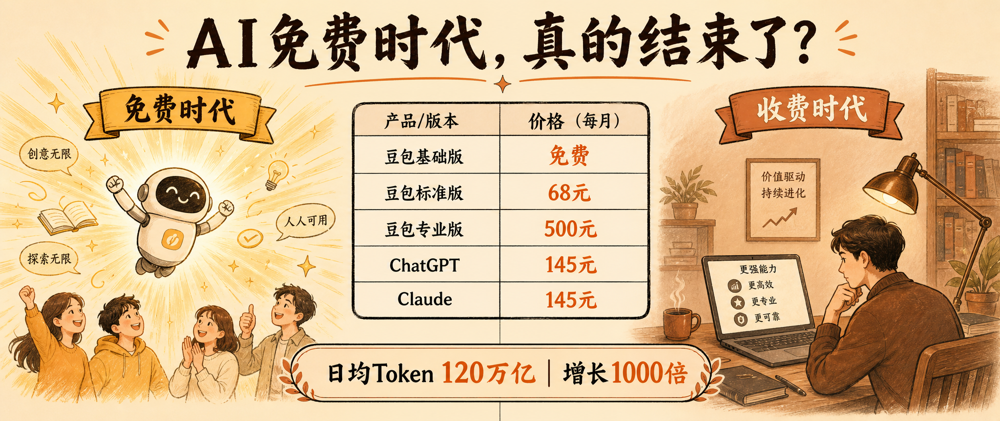
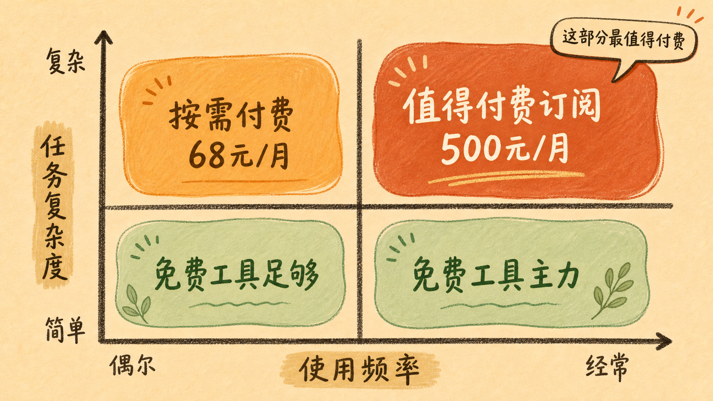

> 运营人必须直面的成本现实

---

你正在用豆包帮客户写一篇小红书笔记——突然，一条推送弹出来：豆包开始收费了。68块一个月。

你愣了一秒：这玩意儿不是一直免费的吗？

没上热搜，没有发布会。但整个运营圈都在问同一个问题：我们的AI工具成本，要涨多少？

这才是这件事真正值得聊的地方。

---

## 不是豆包变了，是时代变了

很多人看到"豆包收费"四个字，第一反应是：字节开始收割了？

没那么简单。

一个更值得追问的数字是：截至今年3月，豆包日均Token调用量突破120万亿。这个数字听起来抽象，换个说法你就懂了——2024年5月刚发布时，这个数字是1200亿。两年，增长了1000倍。

1000倍是什么概念？

相当于你每天用一次AI，到第二年你的用量等于别人用了三年。你以为你在免费用AI，其实字节每天在替你烧掉一套房子。

这不是豆包一家的问题。ChatGPT从2023年开始收费，Claude跟进，Midjourney更是从第一天起就收费。豆包是最后一个宣布收费的国内头部AI应用——不是因为它最良心，而是因为它的用户量最大，120万亿Token背后的成本压力也是最大的。

字节跳动2025年的资本开支约1600亿元，其中900亿砸进了AI算力。900亿什么概念？相当于小米一整年的营收。

说白了，字节不是在做慈善，它是在用千亿级别的投入换一个AI时代的入场券。而现在，这个入场券需要有人买单。

---

## 对运营人来说，这意味着什么？

我见过最典型的运营公司的工作流是这样的：早上用豆包生成5篇小红书笔记，下午用ChatGPT润色公众号文案，晚上用Midjourney做配图。一个月下来，AI工具成本是0。

免费的时代，结束了。

不是说基础功能要收费——豆包官方明确承诺，日常聊天、信息查询这些基础能力永久免费。但PPT生成、数据分析、批量内容处理这些生产力的核心能力，全部进了付费墙。

我自己算过一笔账：如果团队5个人，每个工具都订阅付费版，每月工具成本大概在1500-2000元。以前这笔钱是0。现在突然要算进去，整个报价体系都要重新跟客户谈。

这意味着什么？

**第一，报价体系需要重建。** 过去很多运营公司的AI工具成本是0，现在你得把每月68-500元的工具费算进去。更重要的是，随着豆包开了这个头，文心一言、Kimi跟进只是时间问题。到时候你的AI工具成本可能从0变成每月1000元。

**第二，内容策略需要重新分配。** 不是所有内容都值得用付费AI生产。我见过最聪明的做法是：先用免费工具做选题测试，验证方向对了，再用付费工具批量生产。反过来的公司，基本都在为那些最终被毙掉的选题付冤枉钱。

**第三，人工价值的锚点变了。** 当AI可以批量生成内容时，甲方对你的定价逻辑也变了——他们不再为"产出数量"付费，而是为"判断力"付费。选题的眼光、修改的精度、内容的调性，这些才是付费AI时代，运营人的真正价值。

---

## 真正的问题不是贵不贵，是值不值

68元/月，对一个内容创作者来说，真的不算贵。一杯咖啡的价格，换一个月不限量的PPT生成和数据处理，性价比其实很高。

问题不在于豆包收68元，在于：这68元能帮运营解决多少实际问题？

从我们实测来看，付费版的几个核心能力确实有差异化价值：复杂任务处理能力明显更强，同样一份市场分析报告，付费版给出的结构化和深度都比免费版高出一个档次；批量生成的内容一致性更好，不会出现前后语气割裂的问题；数据分析版可以处理更大的数据集，这是免费版做不到的。

但我也必须说：对于大量"轻度使用"的运营公司，付费版的价值还没有完全体现出来。你一个月只写10篇笔记，付费版能带来的效率提升可能不值这68元。付费版真正发力的场景，是那种每天需要批量处理几十条内容、需要AI做数据整合和报告的团队。

---

## AI收费时代，运营的3条活路

AI工具使用决策矩阵

**1. 把AI当工具，别当员工**

AI最擅长的是重复劳动，最不擅长的是判断。一个选题该不该追，一篇文章的价值在哪里，一个客户的品牌调性是什么——这些永远需要人来判断。把AI用在刀刃上，用在那些真正需要批量的环节。

**2. 建立工具组合，而不是依赖单一工具**

豆包收费不代表它是最好的，也不代表它是唯一的选择。DeepSeek免费，Kimi免费，文心一言也有免费额度。把不同工具用在不同场景，建立自己的"AI工具矩阵"，才能在单一工具涨价时不被卡脖子。

**3. 让人工更贵，而不是更忙**

这是最重要的一条。AI越普及，人的判断力越值钱。如果你做的事情AI都能做，那你的价值就会无限趋近于AI的价格——也就是趋近于0。但如果你做的事情是在AI的产出基础上做判断、做调优、做个性化，那你永远不会失业。

豆包收的不是68块钱。它收的是你的"AI依赖税"——用得越深，被收得越狠。

---

**数据来源**

- 豆包三档订阅方案：标准版68元/月，专业版500元/月 | 新京报、36氪 | 2026年5月
- 日均Token调用量120万亿，较2024年5月增长1000倍 | 综合媒体 | 2026年3月
- 字节跳动2025年AI资本开支900亿元 | 东方财富网 | 2026年
- 豆包月活用户3.45-5.2亿 | 综合数据平台 | 2026年

---

*本文由Holamuse团队出品 | 专注合规运营*