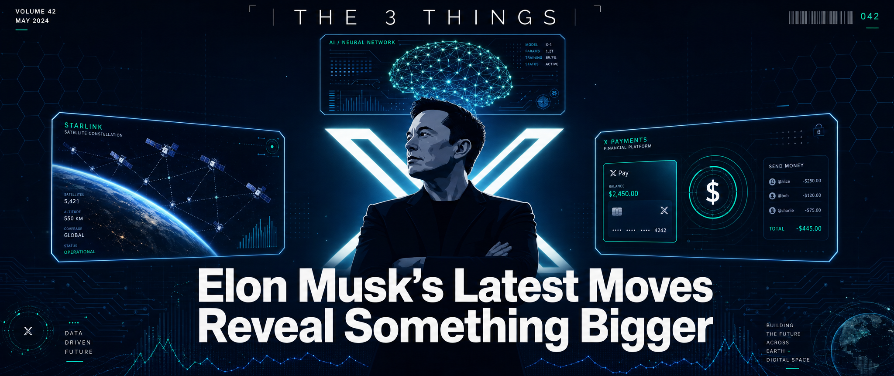
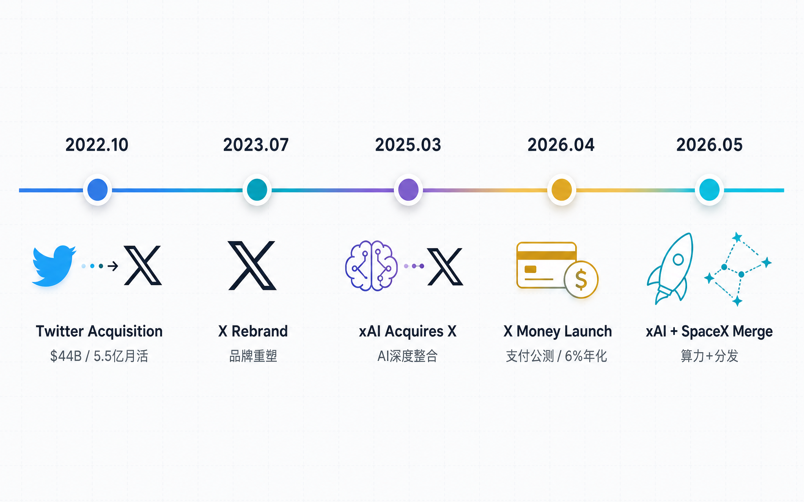

**440亿美元，史上最大的一笔"任性"——马斯克买Twitter那天，全网都在笑他傻。**

Twitter是一家美国公司，当时估值440亿美元。马斯克掏了这笔钱，成为这家社交媒体的新老板。消息一出，硅谷炸了锅。

很多媒体写的是"马斯克又任性了"，是"有钱人的任性"，是"科技大佬的情怀税"。当时全网都在嘲笑他——"硅谷最贵的玩具"。

但如果你也这么看，那你就错过了一场可能是这个时代最精彩的商业实验。

三年过去了，当我们把马斯克最近做的事串起来看，会发现一个让很多人脊背发凉的真相：**他买的不是Twitter，他买的是一张通往"万能应用"的船票。**

什么叫万能应用？

就是这样一个东西：你早上醒来打开它，可以刷信息、看新闻、发帖子；然后用它打车、用它点外卖、用它付款买东西；晚上用它看电影、用它聊天、用它处理工作。

在中国，这个东西叫微信。

马斯克想要的，就是X成为美国版、中国以外的世界的微信。

这个野心，比他造火箭、挖隧道、移民火星，可能还要大。

---

**好，野心是知道了。但他是认真的吗？**

最近三件事，告诉你答案。

**第一件事：xAI并入SpaceX。**

2026年5月6日，马斯克宣布把xAI并入SpaceX。合并后的公司估值1.25万亿美元。

注意这个数字——1.25万亿美元，约等于8个Twitter的收购价。

xAI是马斯克的AI公司，做大模型的。SpaceX是他的太空公司，发火箭的。两个看似八竿子打不着的公司，为什么合并？

因为马斯克想明白了：算力即分发。

SpaceX正在搞一个叫Colossus的超级计算机，用22万块英伟达GPU建造，功率300兆瓦。这个算力不只是用来训练AI模型，还可以用来跑一个分布式的AI算力网络——配合他计划发射的100万颗卫星，在轨道上建AI算力中心。

当算力无处不在，内容分发就会显著改变。

你想，未来你在X上发一条帖子，后台可能是一个卫星上的AI在分析、推荐、触达用户。这不是科幻，这是马斯克正在推进的事。

**第二件事：X Money正式公测。**

2026年4月，马斯克等了三年多的支付功能终于来了。

X Money，不是简单的一个"扫码付款"。它的存款利率是6%，是美国平均水平的15倍——你存一万块钱进去，一年能拿600块利息，比大多数银行的理财产品还高。消费还有3%的现金返现，而且配了一张Visa金属借记卡，全球通用，卡面上印的是你的@账号名。最特别的是，它内置了一个AI助理，是xAI开发的，能帮你追踪每一笔支出、分析消费习惯、优化你的理财。

马斯克自己说的："我们希望做到这样：只要你愿意，你就能在X应用上过完你的生活。"

这不是做一个支付功能，这是把微信支付的路重走一遍——而且用更高的利率、更好的体验。

**第三件事：Grok正在成为X的差异化核心。**

你可能没注意到一个数据：X平台Grok的日均搜索量是2.4亿次，Premium+用户（付费订阅用户）的周使用率是78%。

这意味着什么？

意味着X不只是一个社交媒体了，它正在变成一个AI助手平台。

你可以在X上问Grok任何问题，它会给你回答，而且它结合了你的社交数据，懂你在关注什么、了解什么、需要什么。

这种"社交+AI+搜索"的一体化体验，目前全球还没有第二个产品做到。

---

**微信和X，代表了两种万能应用的路线。**

张小龙先做了聊天，然后做了公众号内容生态，最后做了微信支付。一旦支付打通，微信就从一个聊天工具变成了一个操作系统级别的万能应用。

马斯克呢？他先买了Twitter（有5.5亿月活的内容平台），然后引入xAI的Grok做AI搜索，最后推X Money做支付。三步棋，每一步都在逼近万能应用。

这两种路线谁会赢，现在下结论还太早。

但有一点是确定的：马斯克走的是一条更难的路。因为他要在内容生态已经成熟的美国市场，重新培养用户的支付习惯，重新建立信任体系。

说白了，马斯克在用440亿美元赌一件事——美国的用户，也愿意把日常生活搬到一个App里。这件事微信做到了，但Facebook、WhatsApp折腾了十年都没做到。

这不是技术问题，这是人心问题。

---

**好，聊完了马斯克在做的事。**

作为一个运营人，我们能从中得到什么？

马斯克的野心我们学不来，但他做事的闭环思维，值得每个做运营的人认真琢磨。

**内容自己产。**

马斯克在X上引入了Grok，AI可以帮他生成内容、分析内容、优化内容。

我们做运营的也一样。现在AI写作工具已经非常成熟，Claude、GPT、DeepSeek都可以帮你写文案、做选题、分析数据。

关键不是"AI能不能帮你写"，而是"你会不会用AI写出好东西"。

我见过太多运营人，花钱买了AI工具，然后每天就是让AI生成一堆垃圾内容，发出去石沉大海。

好的用法是什么？

是用AI做选题研究、用AI分析竞品、用AI生成初稿、用人来改稿和把关。**AI是放大器，不是替代品**。

**分发自己控。**

马斯克2026年1月开源了X的核心算法，这一步棋非常聪明——他不藏着掖着了，直接告诉你"我是怎么推荐内容的"。

对于运营人来说，这意味着什么？

意味着你要开始学会看算法脸色，而不是只会闷头写内容。

X的新算法逻辑很简单：**粉丝数不再是决定因素，内容质量才是**。你的帖子能不能被推荐，取决于AI预测它能引发多少互动。

这和小红书的逻辑越来越像了。

所以我建议每个运营人，现在就开始做一件事：**建立你自己的私域分发渠道**。公众号粉丝、小红书粉丝、微信社群——这些都是你自己的流量池，不依赖任何平台算法。

**钱在自己手。**

马斯克推X Money，本质上是让创作者可以在平台内完成"发帖→互动→变现"的全部流程。

你发一条帖子，有人打赏，这是钱；你带了一个货，有人买了，这也是钱；你积累了一个品牌，有人找你投放广告，这还是钱。

对于运营人来说，这条闭环同样适用。

你产出的内容，有没有设计变现路径？

不是说每一条内容都要卖货，但你的账号整体，有没有明确的变现模式？是接广告、做知识付费、还是带自己的产品？

我见过太多运营人，账号做得不错，粉丝也不少，但变现路径模糊，钱始终在别人口袋里。

---

**写到最后，我想说一个有意思的事。**

马斯克从2022年开始做这件事，到今天还没有完全成功。X的日活用户从疫情高点下降了15%，广告收入还不到收购前的一半，债务还有120亿美元。

但他依然在推进，依然在投入，依然在讲那个"万能应用"的故事。

我们做运营的也一样。

你今天开始做选题、研究平台规则、搭建私域流量、设计变现路径……这些事短期内可能看不到效果，甚至可能让你怀疑"这条路走得通吗"。

但方向对了，就不怕路远。

马斯克用440亿买了个教训：万能应用不是一天建成的，但你不开始，就永远没有那一天。

对于运营人来说，你的"万能应用"，可能是你的个人IP，可能是你的内容矩阵，可能是你的变现闭环。

说实话，不一定做完整件事。哪怕只建其中一个闭环，都足够让大多数运营人活得更好。

不管是什么，开始建，就对了。

---

**今日福利：**

我整理了一份「小红书平台运营策略清单」，评论区扣"1"，我发给你。

---

