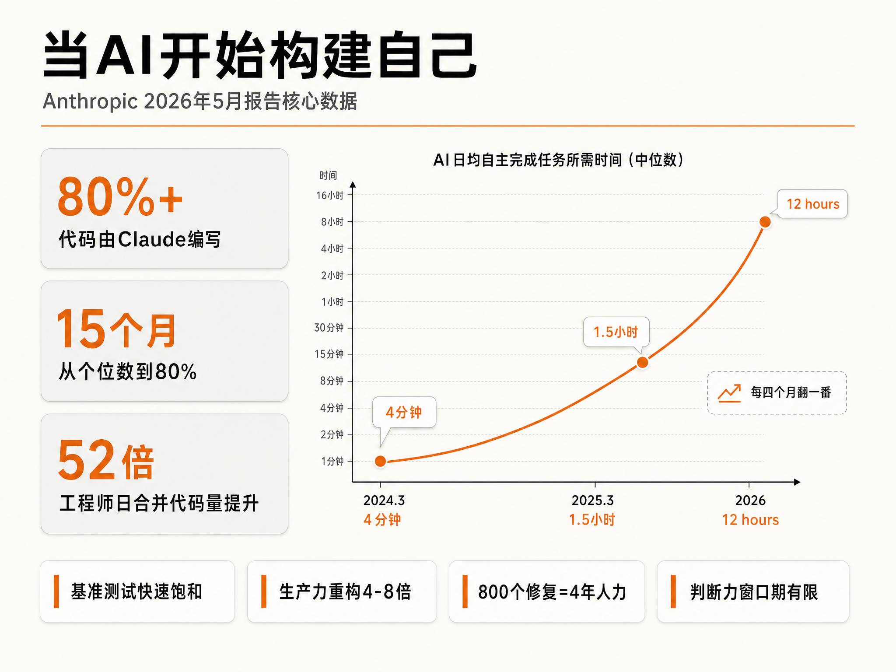
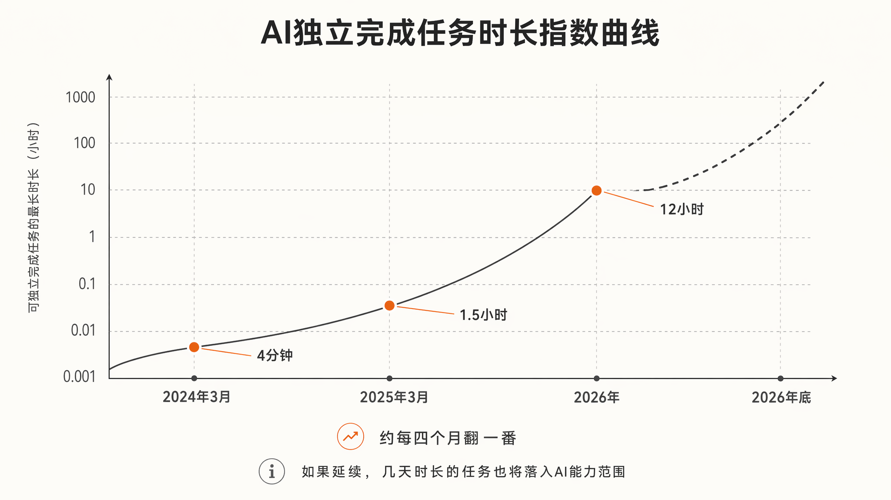
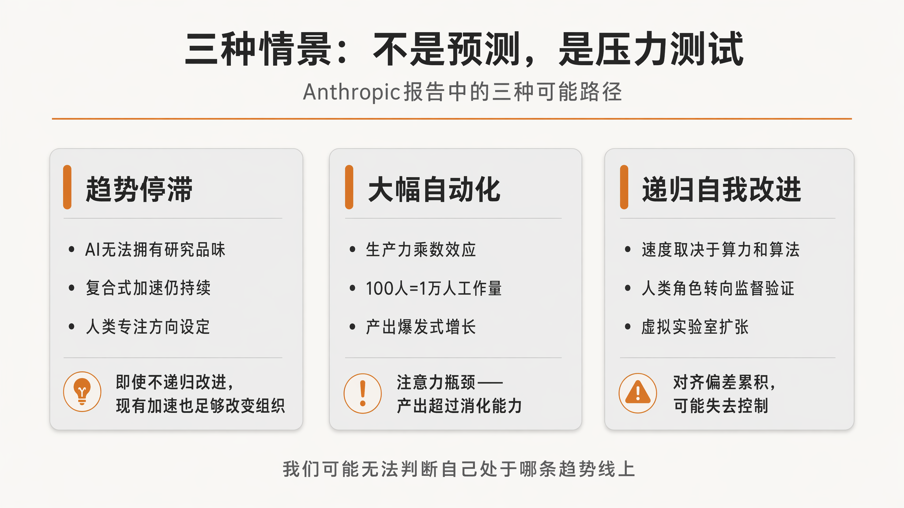
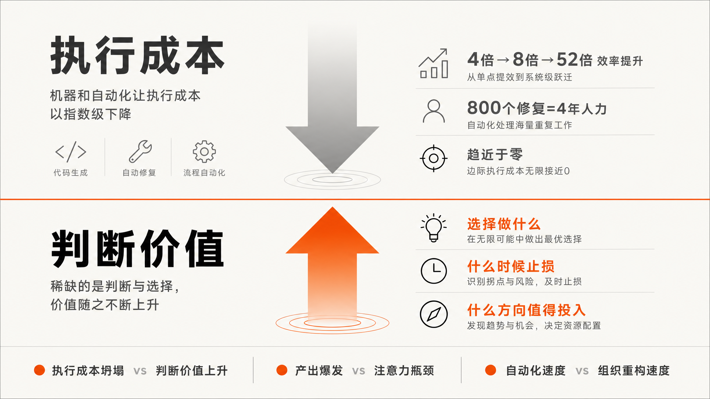

# 执行趋零，判断无价：AI自我构建时代，企业还剩什么不可替代？

  

  

Anthropic 发布了一份报告，说 AI 正在加速构建自己。

  

**80% 的代码由 Claude 编写。工程师的产出是两年前的 8 倍。一个需要人类 4 年才能完成的修复，AI 在 1 个月内交付了 800 个。**

  

这些数字本身足够震撼。但如果只停留在"AI 越来越强了"这个层面，这篇文章就白读了。

  

真正值得看的，不是 Anthropic 在秀肌肉，而是**这份报告作为一份政策叙事，是怎么被设计出来的**——它选择了什么数据、回避了什么问题、制造了什么紧迫感，以及在这些精心编排的数字背后，**有哪些方法论缺陷和被刻意淡化的张力**。

  

更重要的是：**当执行层面的工作趋近于零，企业真正需要守护的，到底是什么？**

  

---

  

## 01 一份被精心设计的技术叙事

  

这份报告的作者 Jack Clark，在加入 Anthropic 之前是 BuzzFeed 和《连线》的科技记者。他对"如何用叙事框架影响政策制定"有深刻理解。

  

整篇文章的结构本身就是一套说服系统：

  

**从外部证据到内部证据，从数据到反思，从现状到未来再到应对。** 读者被引导着走完一条"先接受事实，再接受推论，最后接受政策建议"的认知路径。

  

开篇第一句："在 AI 的大部分历史中，开发周期的每一步都由人类驱动。但在 Anthropic，我们正在将越来越多的 AI 开发工作交给 AI 系统自身来完成。"

  

关键词是**"越来越多的"**——不是"全部"，也不是"已经"，而是"正在进行的方向性变化"。这种措辞在全文反复出现：它允许文章做出宏大声明，同时保留足够的精确性来维护可信度。

  

核心段落更精妙：

  

> "如果把这个趋势推到极致，并给予充足的算力，它所指向的终点，是一个能够完全自主地设计和开发自己下一代的 AI 系统。这就是所谓的递归自我改进。我们还没有走到那一步，递归自我改进也并非必然发生。但它到来的速度，可能远超大多数机构的预期和准备。"

  

这段话做了三件事：

  

1. **设定极限目标**——递归自我改进，一个足够远大的概念

2. **诚实退路**——"我们还没到那一步，也并非必然发生"

3. **紧迫感塑造**——"但可能比你想的更快"

  

**"既诚实又紧迫"的组合，是这篇报告在修辞上最精妙的地方。** 它让你在接受"不确定"的同时，已经被"加速"的焦虑所驱动。

  

时间线的设计同样精心：

  

- 2021–2023：人类在笔记本上写代码

- 2023–2025：聊天机器人辅助片段工作

- 2025–2026：编程智能体自主编写文件

- 今天：智能体自主运行代码，委派数小时任务

- 20XX？：闭合回路，AI 自行构建和训练模型

  

视觉上是一条清晰的指数曲线。但每个阶段之间的边界是模糊的，最后一步用了问号——这是文章中少数几处真正表达不确定性的地方。

  

**问题是：问号被放在最远端的未来，而前面的每一个"→"都被呈现为不可逆转的演进。**

  

---

  

## 02 数据背后的方法论陷阱

  

### 任务时长：一个有问题的衡量标准

  

报告的核心数据是"AI 独立完成任务时长"：

  

- 2024 年 3 月 Claude Opus 3：**4 分钟**

- 2025 年 3 月 Claude Sonnet 3.7：**1.5 小时**

- 2026 年 Claude Opus 4.6：**12 小时**

  

从 4 分钟到 1.5 小时（约 90 倍）花了 12 个月，从 1.5 小时到 12 小时（约 8 倍）又花了约 12 个月。数学上确实呈现加速趋势。

  

**但"任务时长"是一个高度可疑的衡量标准。**

  

在软件工程中，任务时长和工作复杂度之间的关系不是线性的。修复一个 1 小时的 Bug 可能需要理解整个系统的架构，而写 12 小时的样板代码可能只是重复劳动。把这两者放在同一个"时长"坐标轴上比较，**本质上是在比较苹果和橘子**。

  

更隐蔽的问题是**基准测试的任务选择偏差**。SWE-bench 和 CORE-Bench 测试的是"可标准化、可验证、有明确成功指标"的任务——而这恰恰是 AI 最擅长的领域。系统设计、架构决策、需求权衡、用户体验判断，这些没有明确"通过/失败"标准的工作，根本不在基准测试的范围内。

  

**报告用"饱和基准测试"来证明 AI 能力的快速提升，但基准测试的饱和不等于真实世界问题的全面解决。**

  

METR 的 16 小时连续工作数据也值得警惕。报告说 Claude Mythos Preview 能够"至少"连续工作 16 小时，并且处于"METR 在不增加新任务的情况下所能测量的上限"。

  

**"至少"这个词是关键——16 小时是测量上限，不是能力上限。** 但读者很容易把它理解为"AI 能工作 16 小时"，而不是"我们的工具只能测到 16 小时"。

  

  

### 8 倍 vs 4 倍：被刻意展示的张力

  

报告披露了两组生产力数据：

  

- **客观指标**：2026 年 Q2，每位工程师每天合并的代码量是 2024 年的 **8 倍**

- **主观估计**：2026 年 3 月内部调查，130 名研究员中位数估计使用 Mythos Preview 后产出变为 **4 倍**

  

报告主动承认"代码行数是不完美的衡量指标，8 倍几乎肯定是对真实生产力的高估"，然后给出了更保守的 4 倍主观估计。

  

这种"自我质疑"的姿态增强了可信度。但**两组数据之间的张力本身，恰恰暴露了"生产力"在 AI 辅助环境下的定义困境**。

  

当 AI 编写了 80% 的代码，工程师的角色转向"指导和审查"，"产出"到底该怎么衡量？是代码行数？是合并次数？是问题解决数量？还是"本来就会去做的项目"的主观感受？

  

**报告没有回答这个问题，而是把两种衡量方式并置，让读者自己选择一个愿意相信的数字。**

  

### 52 倍加速：一个被高度控制的实验

  

最惊人的数据是 52 倍代码加速：Claude Mythos Preview 在"优化训练小型 AI 模型的代码"任务中，将代码速度提升了约 52 倍。作为参照，一名熟练的人类研究员需要 4-8 小时才能达到 4 倍。

  

但这是一个**"目标和成功指标预先固定"的环境**。AI 最擅长的，恰恰是在目标明确、反馈即时、搜索空间可穷举的任务中不知疲倦地迭代。

  

**现实世界中的研究问题，往往不是"怎么让代码更快"，而是"这段代码值不值得写"。** 后者涉及价值判断、资源权衡、方向选择——这些恰恰不在 52 倍加速的测量范围内。

  

### "下一步决策"测试：选择偏差与评判标准的主观性

  

报告中最具争议的内部实验，是"下一步决策"测试：

  

> 找到研究员"绕了弯路"的时刻，只将偏离之前的工作内容展示给 Claude，问它下一步会怎么做。另一个能看到整个会话最终走向的 Claude 实例负责评判：是 AI 还是人类给出了更好的下一步建议。

  

结果：2025 年 11 月 Opus 4.5 有 **51%** 的时间给出更好建议，2026 年 4 月 Mythos Preview 增长到 **64%**。

  

**这个实验存在严重的选择偏差**：样本全部来自"人类失误"的时刻。如果测试的是"人类做出正确决策"的时刻，结果可能会完全不同。

  

更根本的问题是**评判标准的主观性**：由另一个 Claude 实例来评判"哪个建议更好"，而不是独立的人类评估者。这相当于让考生自己批改试卷。

  

---

  

## 03 三种情景：稻草人论证与真实张力

  

报告提出了三种未来情景，但每种情景的呈现方式都值得拆解。

  

  

### 情景一：趋势停滞——被刻意削弱的对手

  

报告认为这种情景"可能性不高"，理由是：即使 Claude 永远无法拥有良好的研究品味，保守解读仍然意味着复合式加速。如果人类只做方向设定，AI 处理一切执行，每位工程师驾驭的工作规模远超从前。

  

**但"趋势停滞"的论证被设置成了一个稻草人**：它假设停滞意味着"完全没有任何进步"，而不是"进步速度放缓"或"在某些领域遇到瓶颈"。报告没有认真讨论后两种可能性。

  

Project Glasswing 被用来支撑这一情景的乐观预期：Mythos Preview 在全球最重要的系统中发现了超过一万个高危和严重级别的软件漏洞。网络安全防御的瓶颈从"发现漏洞"转移到了"能否足够快地修补"。

  

**但"发现漏洞"和"理解漏洞的系统性影响"是两回事。** AI 可以扫描代码找出潜在问题，但判断哪些漏洞真正值得优先修复、哪些修复可能引入新的系统性风险，仍然需要人类的判断。

  

### 情景二：大幅自动化——正在进入的"舒适区"

  

这是报告认为"很可能正在进入"的情景：使用 AI 的组织将变得高效得多，100 人的公司可以完成一万人甚至十万人组织的工作量。

  

报告坦诚地提到了阿姆达尔定律的症状："由于 Anthropic 员工与高能力模型的协作，新的想法、计划、工具和模拟呈爆发式增长，远远超出了我们有能力去追踪的范围。"

  

**这句话的潜台词是：我们已经在信息过载中迷失了。** 当产出呈指数增长，但人类的追踪和理解能力没有同步增长，"效率"的定义本身就变得可疑。

  

100 人做出 10000 人的体量，但如果这 10000 人的体量中，有 90% 是没有人真正理解或验证过的，这还是"效率"吗？还是只是**"不可控的产出膨胀"**？

  

### 情景三：递归自我改进——最不确定，但被放在最显眼的位置

  

报告对递归自我改进的描述最为谨慎，但也最为惊悚：

  

> "在这个世界里，AI 发展的速度将完全取决于可用算力。人类在 AI 开发中的角色将大幅缩减，大部分精力可能转向对一个不断扩张的 AI '虚拟实验室'进行监督、验证和确认。"

  

> "我们对齐问题会如何被解决——或者无法被解决，是我们最不确定的部分。模型可能被证明足够对齐，也足够具备研究品味，从而发现并实施新颖解决方案。它们也可能足够审慎，在条件不成熟时选择暂停开发。另一种可能性是，今天模型中偶尔出现的对齐偏差，在模型构建自己继任者的过程中不断累积，但越来越难以被理解，直到我们失去对它们的控制。"

  

**"也可能"、"另一种可能性"、"直到我们失去控制"——这些措辞在制造一种特定的情绪：不是确定的恐惧，而是不确定的焦虑。** 这种焦虑比确定的恐惧更能驱动政策行动。

  

---

  

## 04 政策呼吁的几乎不可能性

  

报告的最后部分是一份政策呼吁：

  

> "让世界拥有减缓甚至暂时暂停前沿 AI 开发的选项，从而让社会结构和对齐研究能跟上技术前进的步伐，对世界是有益的。"

  

但 Anthropic 提出了三个条件：

  

1. **存在一个可信的体系**——谁来定义"可信"？

2. **其他前沿开发者也减速**——在囚徒困境中，谁会先减速？

3. **减速是可验证的**——如何验证一个 AI 实验室是否真的在减速？

  

**这三个条件构成了一个几乎不可能同时满足的组合。**

  

"可信的体系"需要国际协调，但 AI 竞赛已经被框定为国家安全议题。"其他开发者也减速"需要信任，但实验室之间的信任在零和竞争中几乎不存在。"可验证的减速"需要透明，但透明意味着暴露技术细节，这在商业竞争中是自杀性的。

  

报告说"如果这样的体系存在，我们预计我们会选择减速或暂时暂停"。**这是一个永远不会被触发的承诺，因为前提条件被设计为几乎不可能实现。**

  

---

  

## 05 被回避的四个关键问题

  

### 利益冲突：谁从这份报告中获益？

  

整份报告的数据来源是 Anthropic 自身。作为一家商业 AI 公司，它的估值、融资能力、人才吸引力，直接依赖于"AI 能力正在快速进步"这一命题被广泛接受。

  

**这不是说数据是假的，而是说数据的呈现方式、选择标准、解读框架，都不可避免地受到商业利益的影响。**

  

报告没有披露任何负面数据。没有提到 AI 在哪些任务上失败了，没有提到 80% 的代码中有多大比例需要人类大量修改，没有提到 52 倍加速的实验中有多少次完全失败。

  

### 能力的非均匀分布：AI 强在哪里，弱在哪里？

  

报告描述的 AI 能力进步，主要集中在软件工程和 AI 研究任务——**这恰好是 Anthropic 的核心业务领域**。

  

但 AI 在创意判断、战略决策、情感理解、跨领域整合、价值观权衡等方面的能力如何？报告几乎完全回避了这些问题。

  

**"AI 正在变强"是一个整体叙事，但真实的能力分布是高度不均匀的。** 在某些领域，AI 可能已经超越人类；在另一些领域，它可能仍然非常笨拙。报告没有帮助读者理解这种不均匀性。

  

### 劳动市场的结构性变革：100 人做出 10000 人体量，意味着什么？

  

报告轻描淡写地提及了"100 人的公司可能做出 10000 人公司的体量"，但没有深入讨论这对劳动市场的含义。

  

如果这是真的，那么**中间层级的管理者、执行者、协调者，将面临什么样的命运？** 不是"被替代"这么简单的叙事，而是"工作内容的重构"——从执行转向监督，从创造转向审查，从主动转向被动。

  

报告引用了一位 Anthropic 员工的话：

  

> "在一切顺利的日子里，我忍不住觉得自己做的事都不重要了，一切都被自动化了，而且比我做得更好更快。但总有些日子，所有东西都在崩溃，我不知道为什么，那时候我才意识到，我已经不太清楚自己到底一直在干什么了。"

  

**这是意义感的断裂，不是技能过时的问题。** 当执行层面的工作被自动化，人类不仅失去了工作机会，还失去了通过工作建立自我认知的途径。

  

### 对齐研究的真实状态：我们到底有多少时间？

  

报告反复提到对齐问题（alignment）的重要性，但没有透露 Anthropic 在对齐研究上的真实进展。

  

"对齐"是指确保 AI 系统的目标和行为与人类的价值观一致。如果递归自我改进真的发生，对齐问题必须在 AI 能够自主改进自己之前得到解决。否则，**一个不对齐的 AI 系统可能会设计出更不对齐的继任者**。

  

报告说"我们对这个世界会是什么样子缺乏好的直觉，因为我们当前的经济体系是由人类和人类构建的工具驱动的"。**这句话的潜台词是：我们甚至没有框架来思考这个问题。**

  

---

  

## 06 关键金句的深度评注

  

报告中有几句值得反复咀嚼的话：

  

> "爱迪生说天才是 1% 的灵感加 99% 的汗水。但我们看到的是，那 99% 的汗水正在被越来越多地自动化。"

  

**评注**：这句话的冲击力在于它重新定义了"天才"的含义。如果汗水可以被自动化，那么灵感——也就是判断、品味、方向选择——成为唯一不可替代的东西。但报告同时暗示，"研究品味"可能也只是"下一项被 AI 攻克的领域"。**如果灵感也被自动化，人类还剩下什么？**

  

> "人类目前仍保有比较优势的领域是研究品味和判断力：选择哪些问题重要、哪些结果可信、什么时候一条路走不通该及时止损。"

  

**评注**：这句话在报告中出现了两次，但两次的语境不同。第一次是作为"人类的保留地"，第二次是作为"下一个被攻克的领域"。**这种矛盾不是疏忽，而是反映了 Anthropic 自己也不确定"研究品味"到底能不能被自动化。**

  

> "工作（和生活）过去运行在人与人之间小恩小惠的礼物经济上。'能帮我把这个脚本跑起来吗？'……每一次都创造一点点人情债，一点点彼此的联结。Claude 更快，它不产生任何人情债，但每一次这样的替代，都是一次人际协作的机会的失去。"

  

**评注**：这是整份报告中最有人性温度的一段话。它指出了一个被技术叙事完全忽略的问题：**效率的提升可能以社会联结的瓦解为代价。** 当协作被自动化，组织不仅失去了效率之外的价值，还可能失去了应对突发危机的韧性——因为没有人真正"理解"系统在做什么。

  

  

---

  

## 07 企业映射：当执行趋零，判断无价

  

把 Anthropic 的报告转译成企业语言，核心问题只有一个：

  

**当 AI 能够完成 80% 的执行工作，你的团队还剩下什么不可替代的价值？**

  

### 内容系统的重构逻辑

  

报告中的"80% 代码由 AI 编写"，映射到内容领域就是：**80% 的内容生产可以被 AI 自动化**——从选题、初稿、排版到分发。

  

但内容工作的价值分布，和代码工作一样不均匀：

  

- **执行层**：写稿、排版、发布、数据收集——正在快速自动化

- **判断层**：选题是否值得做、角度是否独特、调性是否一致、能否形成资产——仍然是人类的核心能力

- **方向层**：品牌定位、内容战略、长期价值判断——短期内难以被 AI 替代

  

**问题是：大多数团队把 80% 的精力花在执行层，只把 20% 的精力花在判断层。** 当执行层被自动化，这 80% 的精力释放出来后，团队是否有能力把它转移到判断层？

  

### 能人驱动 vs 系统驱动

  

报告中的"工程师转向指导和审查"，映射到内容团队就是：**从"能写"转向"能判断"**。

  

但"能判断"不是个人天赋，而是系统能力。它包括：

  

- **内容判断标准**：什么样的内容值得做，什么样的不值得

- **反馈闭环**：内容发布后的数据如何回流到判断标准中

- **可复盘机制**：每次内容决策的结果如何被记录和学习

- **可复制框架**：好的判断如何被编码成团队共享的知识

  

**没有系统驱动的判断，释放出来的精力只会变成无序的产出膨胀。** 就像 Anthropic 面临的阿姆达尔定律症状：想法、计划、工具爆发式增长，但没有人能追踪和理解。

  

### 增长链路的重新设计

  

当执行成本趋近于零，**竞争的关键从"谁能生产更多"转向"谁能判断更好"**。

  

这意味着：

  

- **内容数量不再稀缺，内容质量的标准在上升**

- **发布频率不再重要，内容资产的复利效应在放大**

- **短期流量不再关键，长期信任的建立成为壁垒**

  

企业需要重新设计增长链路：从"生产-发布-获取流量"的线性模型，转向"判断-生产-验证-沉淀"的闭环模型。

  

---

  

## 08 可带走的判断框架

  

面对 AI 自我构建的趋势，企业决策者可以问自己三个问题：

  

**第一：你的团队中，有多少精力花在"执行"，有多少花在"判断"？**

  

如果比例是 80:20，那么 AI 自动化的冲击将是剧烈的。你需要在冲击到来之前，把团队的重心从执行转向判断。

  

**第二：你的"判断"有没有被编码成系统？**

  

个人的判断能力是脆弱的。它随着人员流动而流失，随着认知负荷而衰减。只有被编码成标准、流程、反馈机制的判断，才能形成组织的长期资产。

  

**第三：当执行趋近于零，你的团队靠什么建立意义感？**

  

Anthropic 员工的困惑是真实的："在一切顺利的日子里，我觉得自己做的事都不重要了。" 当工作从"亲手做"变成"监督和审查"，团队需要新的意义来源——可能是对方向的把控，可能是对质量的守护，可能是对长期价值的坚持。

  

---

  

AI 正在构建自己。这不是预测，是 Anthropic 正在发生的事。

  

**但构建的方向、速度、边界，仍然取决于人类的判断。**

  

当 99% 的汗水被自动化，1% 的灵感——也就是判断、品味、方向选择——成为唯一不可替代的东西。

  

**问题是：你的团队，准备好守护这 1% 了吗？**