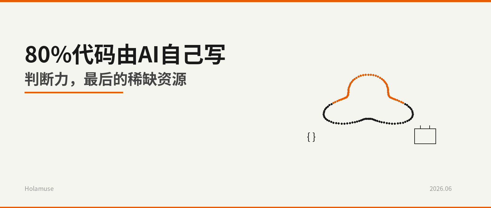
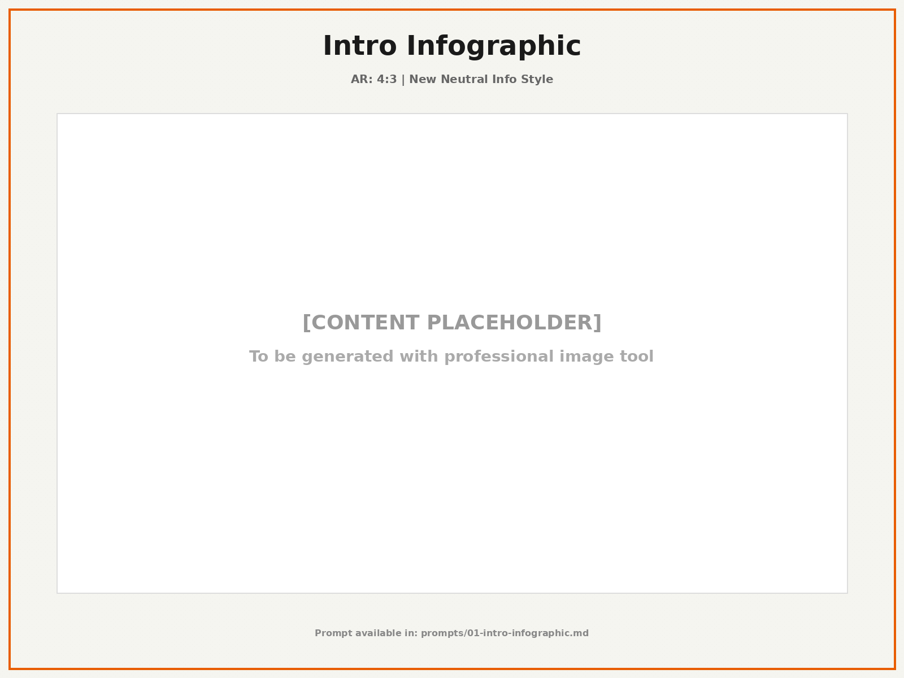
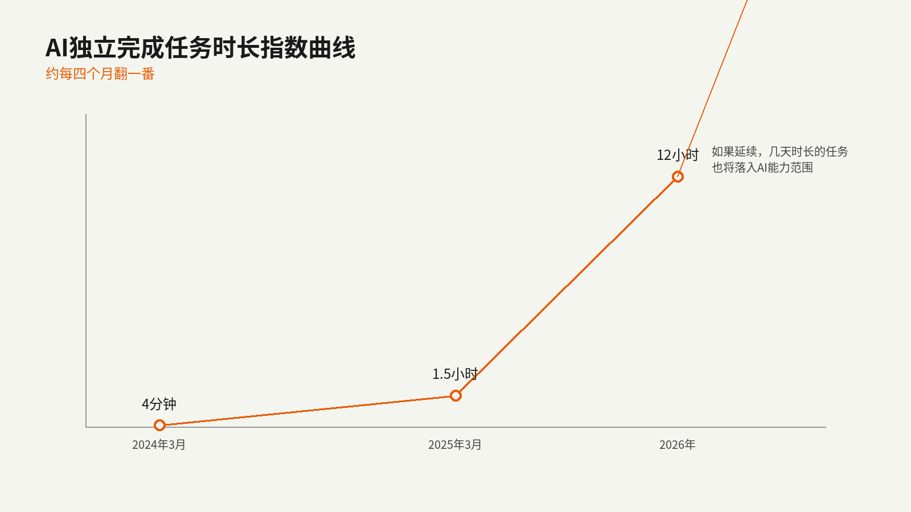
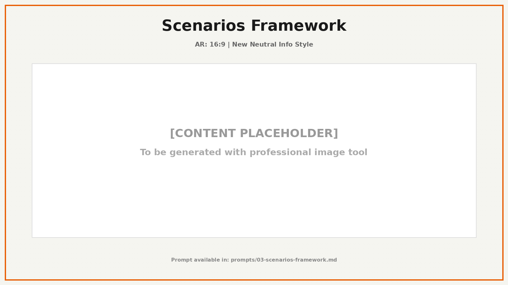
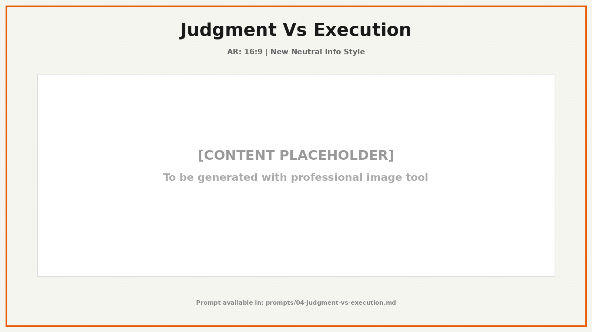

# 图片插入建议

## 文章配图总览

本文共使用 **6 张配图**，全部位于 `/root/.openclaw/workspace-lead/articles/anthropic-ai-self-building/images/` 目录下。

---

## 封面体系（3张）

### 1. 公众号主封面
- **文件**: `images/00-cover.png`
- **比例**: 2.35:1 (1600×680)
- **位置**: 文章最顶部，作为公众号头图
- **图注**: （无需图注，头图不显示 caption）
- **内容**: 极简封面，主标题"80%代码由AI自己写" + 副标题"判断力，最后的稀缺资源" + 递归几何符号

### 2. 小封面/缩略图
- **文件**: `images/00-cover-square.png`
- **比例**: 1:1 (1600×1600)
- **位置**: 用于小尺寸预览、渠道缩略图
- **内容**: 核心数字"80%" + 简化递归符号

### 3. 正文前置信息图
- **文件**: `images/01-intro-infographic.png`
- **比例**: 4:3 (1600×1200)
- **位置**: 文章开头，紧接在封面下方，作为核心数据一览
- **图注**: 图1｜Anthropic 2026年5月报告核心数据一览
- **内容**: 关键数字卡片（80%+、15个月、52倍）+ 任务时长指数曲线 + 核心要点标签

---

## 内容配图（3张）

### 4. 任务时长指数曲线
- **文件**: `images/02-task-duration-curve.png`
- **比例**: 16:9 (1600×900)
- **位置**: 插入到 **"01 一个数字引发的连锁反应"** 小节中，在提到任务时长数据之后
- **建议插入位置**: 在"任务时长的指数曲线，大约每四个月翻一番。"这句话之后
- **图注**: 图2｜AI 独立完成任务时长指数曲线：从 4 分钟到 12 小时，约每四个月翻一番
- **内容**: 2024.3(4分钟) → 2025.3(1.5小时) → 2026(12小时) 的指数上升曲线

### 5. 三种情景框架图
- **文件**: `images/03-scenarios-framework.png`
- **比例**: 16:9 (1600×900)
- **位置**: 插入到 **"03 三种情景：不是预测，是压力测试"** 小节中，在三种情景介绍之前或之后
- **建议插入位置**: 在"Anthropic 在报告中列出了三种可能情景。"这句话之后，作为三种情景的总览图
- **图注**: 图3｜三种情景：趋势停滞、大幅自动化、递归自我改进——不是预测，是压力测试
- **内容**: 三列卡片布局，分别展示三种情景的核心特征与关键风险

### 6. 执行成本坍塌 vs 判断价值上升
- **文件**: `images/04-judgment-vs-execution.png`
- **比例**: 16:9 (1600×900)
- **位置**: 插入到 **"05 从 Anthropic 的实验室，到你的团队"** 小节中
- **建议插入位置**: 在"第一，执行成本的坍塌与判断价值的上升。"这句话之后
- **图注**: 图4｜执行成本坍塌 vs 判断价值上升：当 AI 让执行趋近于零，判断力成为唯一稀缺资源
- **内容**: 上下对比布局，上半部分展示执行成本坍塌（灰色、向下箭头），下半部分展示判断价值上升（橙色强调、向上箭头），底部三组核心矛盾标签

---

## 插入文章的 Markdown 语法

```markdown









```

---

## 预览组合图

- **文件**: `images/cover-preview.png` (1708×510)
- **用途**: 左侧 1:1 小封面 + 右侧 2.35:1 大封面并排预览，总比例 3.35:1
- **说明**: 仅用于验收预览，不替代正式封面

---

## 提示词文件

所有提示词文件保存在 `prompts/` 目录下：
- `prompts/00-cover.md` — 主封面提示词
- `prompts/00-cover-square.md` — 小封面提示词
- `prompts/01-intro-infographic.md` — 前置信息图提示词
- `prompts/02-task-duration-curve.md` — 任务时长曲线提示词
- `prompts/03-scenarios-framework.md` — 三种情景框架提示词
- `prompts/04-judgment-vs-execution.md` — 执行vs判断对比图提示词

---

*生成时间: 2026-06-05*
*模型: gpt-image-2*
*风格: 新中性资讯风 / 科技商业资讯风*
